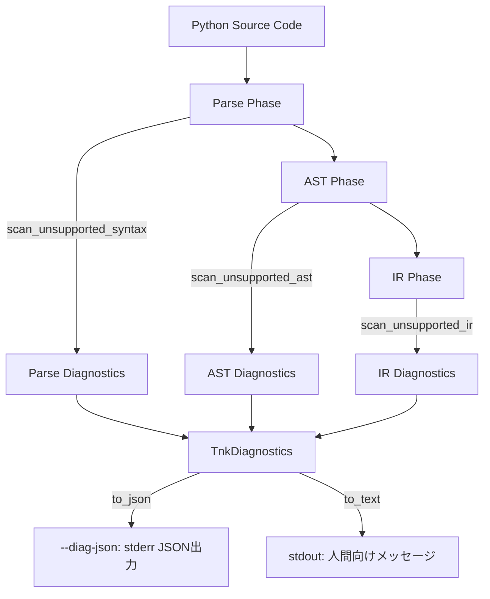

# Tsuchinoko 診断アーキテクチャ

**作成日**: 2026-01-15  
**対象バージョン**: v1.7.0+  
**目的**: 未対応構文の診断機能の実装構造を定義

---

## 📐 アーキテクチャ概要

Tsuchinokoの診断機能は、**3層構造**で未対応構文を検出し、開発者に適切なフィードバックを提供する。



### 設計原則

1. **レイヤー分離**: Parse/AST/IR の各段階で独立した診断を実施
2. **統一インターフェース**: すべての診断は `TnkDiagnostics` に集約
3. **出力戦略**: JSON（機械可読）とText（人間可読）の2形式

---

## 🏗️ コンポーネント構成

### 1. UnsupportedFeature Registry (中央集権的制御)

**場所**: `src/unsupported_features.rs`

**責務**: すべての未対応機能を一元管理し、有効/無効を制御する

#### 構造

```rust
// すべての未対応機能をEnumとして定義（単一真実の源）
#[derive(Debug, Clone, Copy, PartialEq, Eq, Hash)]
pub enum UnsupportedFeature {
    // Statements
    DelStatement,
    MatchStatement,
    TypeStatement,
    GlobalStatement,
    NonlocalStatement,
    
    // Operators
    WalrusOperator,
    
    // Async/Await
    AsyncDef,
    AwaitExpr,
    AsyncFor,
    AsyncWith,
    
    // Generators
    YieldStatement,
    YieldFrom,
    GeneratorExpr,
    
    // Decorators
    CustomContextManager,
    CustomDecorator,
    ClassMethodDecorator,
    
    // Magic Methods
    MagicMethodIter,
    MagicMethodNext,
    MagicMethodSlots,
    MagicMethodCall,
    MagicMethodRepr,
    MagicMethodStr,
    MagicMethodGetItem,
    MagicMethodSetItem,
    MagicMethodDelItem,
    MagicMethodLen,
    MagicMethodContains,
    
    // Class Features
    MultipleInheritance,
    
    // Builtin Functions
    BuiltinIter,
    BuiltinNext,
    BuiltinGetattr,
    BuiltinSetattr,
    BuiltinHasattr,
    BuiltinDelattr,
    BuiltinDir,
    BuiltinVars,
    BuiltinType,
    BuiltinIssubclass,
    BuiltinId,
    BuiltinHash,
    BuiltinFormat,
    BuiltinRepr,
    BuiltinObject,
    BuiltinCompile,
    BuiltinMemoryview,
    BuiltinBytearray,
}

// 中央集権的な有効/無効制御
#[derive(Debug, Clone)]
pub struct UnsupportedFeatureRegistry {
    enabled: HashSet<UnsupportedFeature>,
}

impl UnsupportedFeatureRegistry {
    pub fn new(enabled: HashSet<UnsupportedFeature>) -> Self {
        Self { enabled }
    }

    pub fn is_enabled(&self, feature: UnsupportedFeature) -> bool {
        self.enabled.contains(&feature)
    }

    pub fn enable(&mut self, feature: UnsupportedFeature) {
        self.enabled.insert(feature);
    }

    pub fn disable(&mut self, feature: UnsupportedFeature) {
        self.enabled.remove(&feature);
    }
}
```

#### デフォルト設定

```rust
impl Default for UnsupportedFeatureRegistry {
    fn default() -> Self {
        // すべての未対応機能をデフォルトで有効化
        let enabled: HashSet<UnsupportedFeature> = [
            UnsupportedFeature::DelStatement,
            UnsupportedFeature::MatchStatement,
            // ... 全機能を列挙 ...
        ]
        .into_iter()
        .collect();
        Self { enabled }
    }
}
```

---

### 2. TnkDiagnostics (統一診断コレクション)

**場所**: `src/diagnostics.rs`

**責務**: 診断結果を収集し、JSON/Text形式で出力する

#### データ構造

```rust
#[derive(Debug, Clone, Serialize)]
pub struct DiagnosticSpan {
    #[serde(skip_serializing_if = "Option::is_none")]
    pub file: Option<String>,
    pub line: usize,
    pub column: usize,
    pub end_line: usize,
    pub end_column: usize,
}

#[derive(Debug, Clone, Serialize)]
#[serde(rename_all = "lowercase")]
pub enum DiagnosticSeverity {
    Error,
    Warning,
}

#[derive(Debug, Clone, Serialize)]
pub struct TnkDiagnostic {
    pub code: String,           // "TNK-UNSUPPORTED-SYNTAX"
    pub message: String,         // "unsupported builtin: iter()"
    pub severity: DiagnosticSeverity,
    pub span: DiagnosticSpan,
    pub phase: String,           // "parse", "semantic", "lowering"
    #[serde(skip_serializing_if = "Option::is_none")]
    pub meta: Option<serde_json::Value>,
}

#[derive(Debug, Clone, Serialize, Default)]
pub struct TnkDiagnostics {
    pub diagnostics: Vec<TnkDiagnostic>,
}
```

#### 出力メソッド

```rust
impl TnkDiagnostics {
    pub fn to_json(&self) -> String {
        serde_json::to_string(&self).unwrap_or_else(|_| "{}".to_string())
    }

    pub fn to_text(&self) -> String {
        let mut out = String::new();
        for diag in &self.diagnostics {
            let file = diag.span.file.as_deref().unwrap_or("<input>");
            let line = diag.span.line;
            let col = diag.span.column;
            out.push_str(&format!(
                "[{}] {}:{}:{} {}\n",
                diag.code, file, line, col, diag.message
            ));
        }
        out
    }
}
```

---

### 3. Parse診断 (パターンベース検出)

**場所**: `src/diagnostics.rs` の `scan_unsupported_syntax` 関数

**責務**: ソースコードを行単位でスキャンし、未対応構文を検出

#### 検出パターン

##### A. キーワード検出

```rust
let checks: [(&str, UF, &str); 22] = [
    ("match", UF::MatchStatement, "match statement is unsupported"),
    ("async", UF::AsyncDef, "async is unsupported"),
    ("yield", UF::YieldStatement, "yield is unsupported"),
    // ...
];

for (kw, feat, msg) in checks {
    if !registry.is_enabled(feat) {
        continue;
    }
    if let Some(col) = find_keyword(&line, kw) {
        let span = span_for_line(file, line_no, col + 1, kw.len());
        diags.add(error_diag("TNK-UNSUPPORTED-SYNTAX", msg.to_string(), span, "parse"));
    }
}
```

##### B. Builtin関数検出（標準パターン）

**すべてのbuiltin診断が同型構造を持つ**:

```rust
if registry.is_enabled(UF::BuiltinIter) {
    if let Some(col) = find_builtin_call(&line, "iter") {
        let span = span_for_line(file, line_no, col + 1, "iter".len());
        diags.add(error_diag(
            "TNK-UNSUPPORTED-SYNTAX",
            "unsupported builtin: iter()".to_string(),
            span,
            "parse",
        ));
    }
}
```

**パターンの要素**:
1. `registry.is_enabled()` でチェック
2. `find_builtin_call()` で位置検出
3. `span_for_line()` でスパン生成
4. `error_diag()` で診断追加

##### C. find_builtin_call 関数

**責務**: 関数呼び出しパターンを検出（誤検知を回避）

```rust
fn find_builtin_call(line: &str, name: &str) -> Option<usize> {
    // 以下を除外:
    // - def name() (関数定義)
    // - obj.name() (メソッド呼び出し)
    // 
    // 検出対象:
    // - name(...) (単独の関数呼び出し)
}
```

**誤検知回避ロジック**:
- `def iter():` → 検出しない（関数定義）
- `obj.iter()` → 検出しない（メソッド呼び出し）
- `iter(obj)` → 検出する（builtin呼び出し）

---

### 4. AST診断

**場所**: `src/diagnostics.rs` の `scan_unsupported_ast` 関数

**責務**: ASTノードを走査し、構造的な未対応パターンを検出

**検出例**:
- 多重継承: `class Child(Base1, Base2):`
- カスタムコンテキストマネージャー: `with custom_obj:`

---

### 5. IR診断

**場所**: `src/diagnostics.rs` の `scan_unsupported_ir` 関数

**責務**: IR（中間表現）を走査し、マジックメソッドなどを検出

**検出例**:
- `__iter__`, `__next__` などのマジックメソッド定義

---

## 🔧 新しい未対応機能を追加する方法

### ステップ1: UnsupportedFeature Enumに追加

**ファイル**: `src/unsupported_features.rs`

```rust
pub enum UnsupportedFeature {
    // ... 既存 ...
    BuiltinRepr,
    
    // 新規追加（アルファベット順を維持）
    BuiltinNewFunction,  // 例: new_function() を追加
}
```

### ステップ2: Registry Default に追加

```rust
impl Default for UnsupportedFeatureRegistry {
    fn default() -> Self {
        let enabled: HashSet<UnsupportedFeature> = [
            // ... 既存 ...
            UnsupportedFeature::BuiltinRepr,
            UnsupportedFeature::BuiltinNewFunction,  // 追加
        ]
        .into_iter()
        .collect();
        Self { enabled }
    }
}
```

### ステップ3: 診断ロジック追加

**ファイル**: `src/diagnostics.rs` の `scan_unsupported_syntax` 関数

```rust
// 既存のbuiltin診断ブロックの後に追加
if registry.is_enabled(UF::BuiltinNewFunction) {
    if let Some(col) = find_builtin_call(&line, "new_function") {
        let span = span_for_line(file, line_no, col + 1, "new_function".len());
        diags.add(error_diag(
            "TNK-UNSUPPORTED-SYNTAX",
            "unsupported builtin: new_function()".to_string(),
            span,
            "parse",
        ));
    }
}
```

### ステップ4: ユニットテスト追加

**ファイル**: `src/diagnostics.rs` の `#[cfg(test)]` セクション

```rust
#[test]
fn test_parse_new_function_builtin() {
    let source = "result = new_function(arg)";
    let registry = UnsupportedFeatureRegistry::default();
    let diags = scan_unsupported_syntax(source, None, &registry);
    assert_eq!(diags.diagnostics.len(), 1);
    assert_eq!(diags.diagnostics[0].message, "unsupported builtin: new_function()");
}
```

### ステップ5: システムテスト追加

**ファイル**: `examples/diag/v1_7_0_diag_parse_unsupported_builtins_newfunction.py`

```python
# This should trigger diagnostic
result = new_function(arg)
```

---

## 📊 診断出力形式

### JSON形式（`--diag-json`）

**出力先**: stderr

```json
{
  "diagnostics": [
    {
      "code": "TNK-UNSUPPORTED-SYNTAX",
      "message": "unsupported builtin: iter()",
      "severity": "error",
      "span": {
        "file": "test.py",
        "line": 10,
        "column": 5,
        "end_line": 10,
        "end_column": 8
      },
      "phase": "parse"
    }
  ]
}
```

### Text形式（デフォルト）

**出力先**: stdout

```
[TNK-UNSUPPORTED-SYNTAX] test.py:10:5 unsupported builtin: iter()
```

---

## 🎨 設計原則

### 1. 同型性（Isomorphism）
すべてのbuiltin診断は同じパターンを持つ：
- Registry check
- `find_builtin_call` による検出
- span生成
- `error_diag` 追加

### 2. 単一真実の源（Single Source of Truth）
- `UnsupportedFeature` Enum がすべての未対応機能を定義
- `UnsupportedFeatureRegistry` が有効/無効を中央管理

### 3. 宣言的プログラミング
- 「何を検知するか」を明示的に記述
- 「どう検知するか」は `find_builtin_call` などの抽象化で隠蔽

### 4. 拡張容易性
- 新しい未対応機能を追加するには、5つのステップを踏むだけ
- すべてのステップが機械的に実行可能

---

## 📝 注意事項

### 行番号・カラムの精度

- **Parse フェーズ**: 正確な行番号・カラム
- **AST/IR フェーズ**: 暫定 1:1（span情報未整備）

今後、span情報を整備することで、AST/IRフェーズでも正確な位置情報を提供できるようになる。

### 誤検知の可能性

`find_builtin_call` は正規表現ベースの簡易スキャンであるため、以下のケースで誤検知の可能性がある：

- 文字列リテラル内の関数名
- コメント内の関数名

これらは `mask_string_literals` や `strip_trailing_comment` で対処済みだが、完全ではない。

---

## 🔗 関連ドキュメント

- [unsupported_features.md](unsupported_features.md) - 未対応機能一覧
- [supported_features.md](supported_features.md) - 対応済み機能一覧
- [v1.7.0_requirements.md](v1.7.0_requirements.md) - v1.7.0要件定義書
