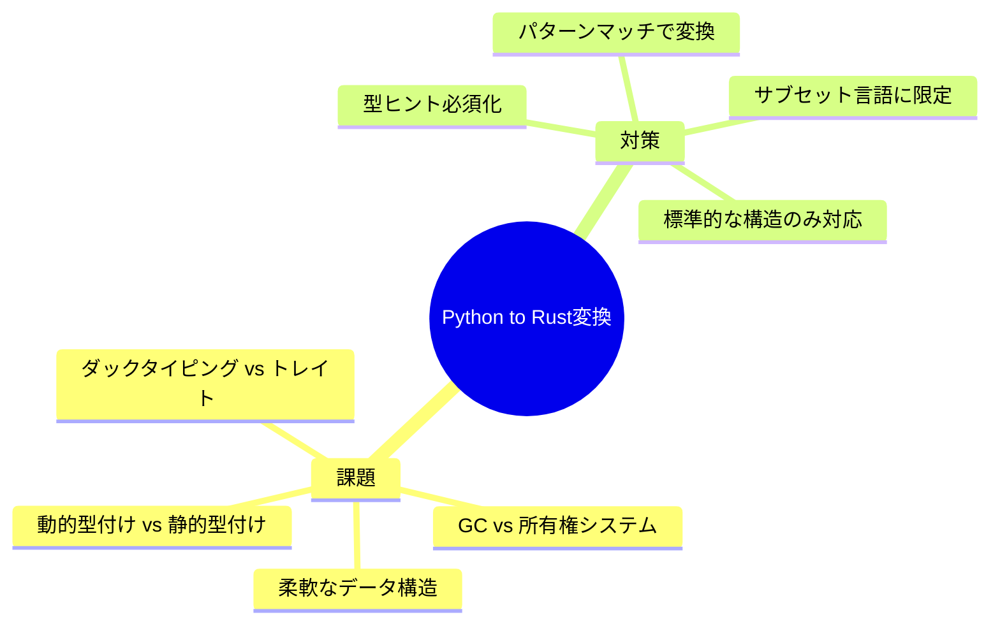
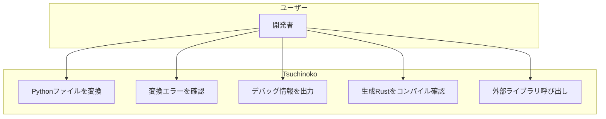
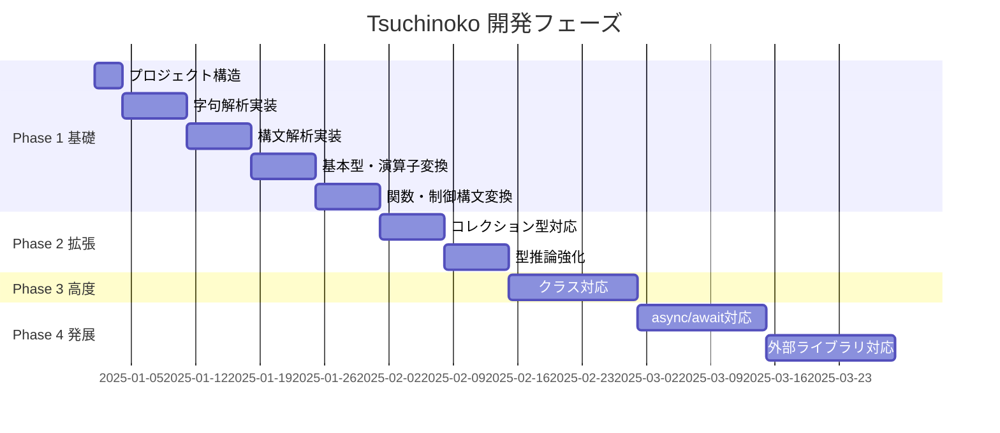

# Tsuchinoko 要件定義書

> **著者**: Tane Channel Technology  
> **バージョン**: 0.5.0  
> **最終更新**: 2025-12-26

---

## 1. プロジェクト概要

**Tsuchinoko** は、PythonコードをRustコードへ変換するトランスパイラである。

> [!NOTE]
> **たねちゃんの哲学**
> - Python = 処理を記述する言語
> - Rust = 構造を記述する言語
> - 将来的にはリファクタリング提案も視野に

### 1.1 背景と目的

| 項目 | 内容 |
|------|------|
| 背景 | Pythonの柔軟性とRustの安全性・速度を両立したい需要がある |
| 目的 | 制限付きPythonコードを正確なRustコードへ変換する |
| 対象ユーザー | Python開発者でRustへの移行を検討している人 |

---

## 2. 実現可能性分析

### 2.1 課題と対策



### 2.2 結論

> **結論**: **制限付きなら実現可能**

| アプローチ | 実現性 | 説明 |
|------------|--------|------|
| 完全汎用変換 | 不可能 | Pythonの動的性質を完全に再現できない |
| 型ヒント付きサブセット | 可能 | 静的解析可能な範囲に限定 |
| 特定パターン変換 | 可能 | アルゴリズム実装など定型的コード |

### 2.3 採用アプローチ：字句解析・構文解析方式


---

## 3. 機能要件

### 3.1 サポート対象Python構文

| ID | 機能 | 詳細 | 優先度 | Phase |
|----|------|------|--------|-------|
| F-001 | 変数宣言 | 型ヒント付き変数の変換 | 高 | 1 |
| F-002 | 基本型 | int, float, str, bool | 高 | 1 |
| F-003 | 算術演算 | +, -, *, /, %, ** | 高 | 1 |
| F-004 | 比較演算 | ==, !=, <, >, <=, >= | 高 | 1 |
| F-005 | 論理演算 | and, or, not | 高 | 1 |
| F-006 | 関数定義 | def文、引数、戻り値型ヒント | 高 | 1 |
| F-007 | if文 | if/elif/else | 高 | 1 |
| F-008 | for文 | range, リストイテレーション | 高 | 1 |
| F-009 | while文 | 条件ループ | 中 | 1 |
| F-010 | リスト | list型からVec変換 | 高 | 1 |
| F-011 | タプル | tuple型からタプル変換 | 中 | 2 |
| F-012 | 辞書 | dict型からHashMap変換 | 中 | 2 |
| F-013 | クラス | 基本的なclass定義 | 低 | 3 |
| F-014 | 例外処理 | try/exceptからResult変換 | 低 | 3 |
| F-015 | async/await | 非同期処理からtokio変換 | 低 | 4 |
| F-016 | 外部ライブラリ | Pythonラッパー経由で間接呼び出し | 中 | 4 |
| F-017 | プロジェクト生成 | Cargo.toml含むRustプロジェクトフォルダ出力 | 高 | 1 |

### 3.2 サポート対象外

| 項目 | 理由 | 将来対応 |
|------|------|----------|
| 動的型変更 | Rustでは型が固定 | 不可 |
| eval/exec | 動的コード実行は不可 | 不可 |
| メタクラス | Rustに対応概念なし | 不可 |
| 動的属性アクセス | getattr/setattrは静的解析不可 | 不可 |
| 多重継承 | Rustはトレイトベース | トレイト変換で部分対応 |
| *args/**kwargs | 可変引数は型推論困難 | 制限付き対応検討 |
| デコレータ | 複雑な変換が必要 | 一部対応検討 |
| プロパティ | getter/setter | メソッド変換で対応検討 |
| with文 | コンテキストマネージャ | Drop/スコープガード変換 |

### 3.3 タプル変換の制限事項

> [!WARNING]
> PythonタプルとRustタプルは概念が異なる

| 観点 | Python tuple | Rust tuple |
|------|-------------|------------|
| 長さ | 可変（実行時） | 固定（コンパイル時） |
| 要素型 | 異種混合OK | 各位置で型固定 |
| 用途 | リストの代替にも使用 | 複数値の返却が主 |

**対応方針**:
- 型ヒント付きタプルのみ変換対応
- 異種混合は型ヒントで明示必須
- 型不明の場合はエラー出力

---

## 4. 非機能要件

| NFR-ID | カテゴリ | 要件 | 検証方法 |
|--------|----------|------|----------|
| PERF-001 | Performance | 1000行のPythonを5秒以内に変換 | cargo bench |
| REL-001 | Reliability | 変換エラー時に明確なエラーメッセージ | 異常系テスト |
| MAIN-001 | Maintainability | 新構文追加が容易な設計 | コードレビュー |
| USA-001 | Usability | CLIで簡単に使用可能 | 手動テスト |
| TEST-001 | Testability | カバレッジ80%以上 | cargo tarpaulin |

---

## 5. ユースケース



### 5.1 メインユースケース

| UC-ID | ユースケース | アクター | 前提条件 | 期待結果 |
|-------|-------------|---------|----------|----------|
| UC-001 | Pythonファイル変換 | 開発者 | 型ヒント付きPythonファイル | 等価なRustファイル生成 |
| UC-002 | エラー確認 | 開発者 | 未対応構文を含むファイル | 明確なエラーメッセージ |
| UC-003 | デバッグ出力 | 開発者 | --debugオプション指定 | 中間表現・型情報出力 |
| UC-004 | 外部ライブラリ呼び出し | 開発者 | PyO3ラッパー経由 | Pythonライブラリを間接利用 |

---

## 6. CLI仕様

### 6.1 コマンド名: `tnk`

```bash
$ tnk input.py

Options:
  --debug         変換処理のデバッグ情報を出力
  -o output.rs    出力先Rustファイルを指定
  --check         変換可能性のみチェック
```

> [!TIP]
> `tnk` = Tsuchinoko の略。読み方は自由

---

## 7. 実装言語・技術スタック

> [!IMPORTANT]
> **Tsuchinoko自体をRustで実装する**

| 項目 | 内容 |
|------|------|
| 言語 | Rust |
| パーサー | pest - PEG文法ベース |
| CLI | clap |
| テスト | cargo test |
| カバレッジ | cargo tarpaulin |

### 7.1 pestを採用する理由

| 利点 | 説明 |
|------|------|
| 文法の分離 | .pestファイルで文法を明示的に定義 |
| 可読性 | PEG記法で直感的に理解しやすい |
| メンテナンス性 | 新構文追加が容易 |
| エラーメッセージ | 分かりやすいパースエラー |
| ドキュメント | 充実したエコシステム |

---

## 8. 開発フェーズ計画



---

## 9. 参考資料

- 旧ドキュメント: `docs_old/`
- 旧実装: `src_v0.5/`
