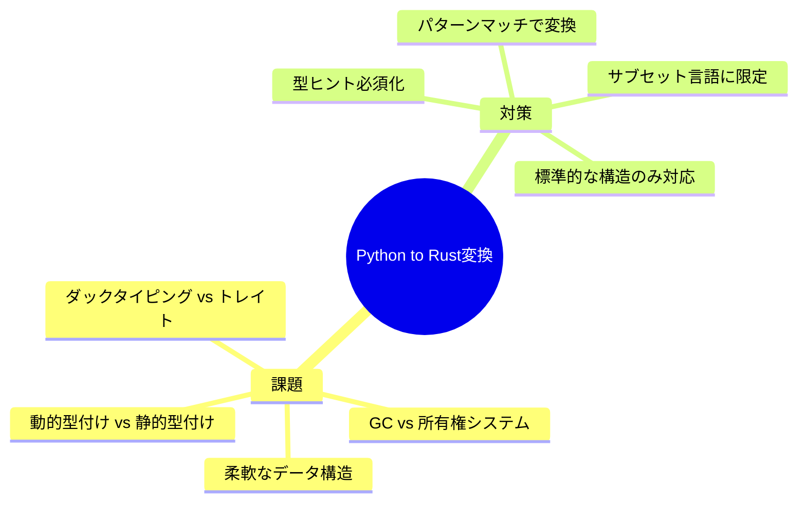
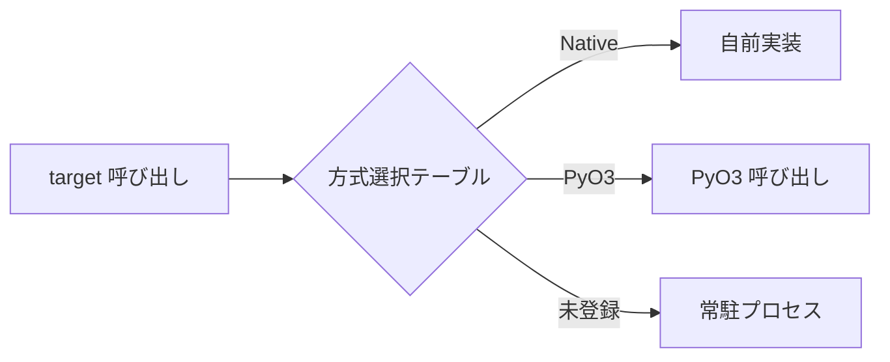
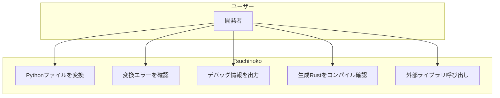
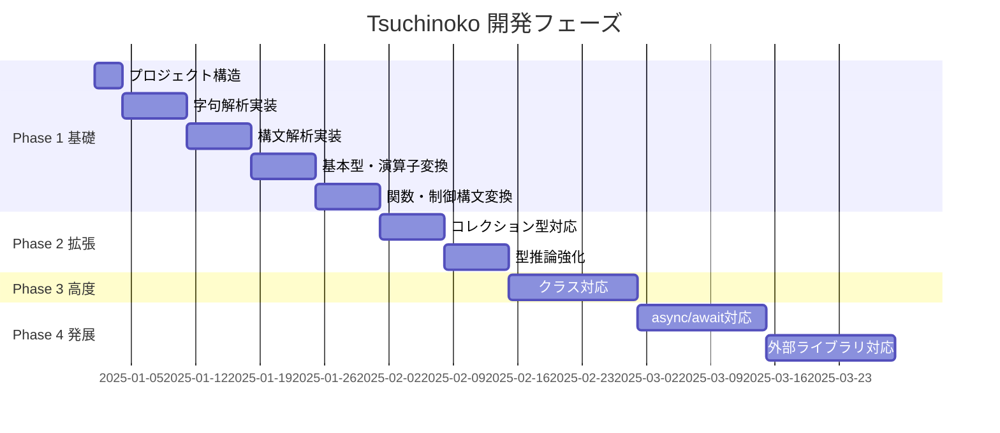

# Tsuchinoko 要件定義書

> **著者**: Tane Channel Technology  
> **バージョン**: 1.7.0  
> **最終更新**: 2026-01-13

---

## 1. プロジェクト概要

**Tsuchinoko** は、PythonコードをRustコードへ変換するトランスパイラである。

> [!NOTE]
> **たねちゃんの哲学**
> - Python = 処理を記述する言語
> - Rust = 構造を記述する言語
> - 将来的にはリファクタリング提案も視野に

### 1.1 背景と目的

| 項目 | 内容 |
|------|------|
| 背景 | Pythonの柔軟性とRustの安全性・速度を両立したい需要がある |
| 目的 | 制限付きPythonコードを正確なRustコードへ変換する |
| 対象ユーザー | Python開発者でRustへの移行を検討している人 |

---

## 2. 実現可能性分析

### 2.1 課題と対策



### 2.2 結論

> **結論**: **制限付きなら実現可能**

| アプローチ | 実現性 | 説明 |
|------------|--------|------|
| 完全汎用変換 | 不可能 | Pythonの動的性質を完全に再現できない |
| 型ヒント付きサブセット | 可能 | 静的解析可能な範囲に限定 |
| 特定パターン変換 | 可能 | アルゴリズム実装など定型的コード |

### 2.3 採用アプローチ：字句解析・構文解析方式


---

## 3. 機能要件

### 3.1 サポート対象Python構文

| ID | 機能 | 詳細 | 優先度 | Phase | 状態 |
|----|------|------|--------|-------|------|
| F-001 | 変数宣言 | 型ヒント付き変数の変換 | 高 | 1 | ✅ |
| F-002 | 基本型 | int, float, str, bool | 高 | 1 | ✅ |
| F-003 | 算術演算 | +, -, *, /, %, ** | 高 | 1 | ✅ |
| F-004 | 比較演算 | ==, !=, <, >, <=, >= | 高 | 1 | ✅ |
| F-005 | 論理演算 | and, or, not | 高 | 1 | ✅ |
| F-006 | 関数定義 | def文、引数、戻り値型ヒント | 高 | 1 | ✅ |
| F-007 | if文 | if/elif/else | 高 | 1 | ✅ |
| F-008 | for文 | range, リストイテレーション | 高 | 1 | ✅ |
| F-009 | while文 | 条件ループ | 中 | 1 | ✅ |
| F-010 | リスト | list型からVec変換 | 高 | 1 | ✅ |
| F-011 | タプル | tuple型からタプル変換 | 中 | 2 | ✅ |
| F-012 | 辞書 | dict型からHashMap変換 | 中 | 2 | ✅ |
| F-013 | クラス | 基本的なclass定義 | 低 | 3 | ✅ |
| F-014 | 例外処理 | try/exceptからcatch_unwind変換 | 低 | 3 | ✅ V1.1.0 |
| F-015 | async/await | 非同期処理からtokio変換 | 低 | 4 | - |
| F-016 | 外部ライブラリ | Pythonラッパー経由で間接呼び出し | 中 | 4 | - |
| F-017 | プロジェクト生成 | Cargo.toml含むRustプロジェクトフォルダ出力 | 高 | 1 | ✅ |
| F-018 | 名前付き引数 | func name="value" | 高 | 1.1 | ✅ V1.1.0 |
| F-019 | デフォルト引数 | def func x=10 | 高 | 1.1 | ✅ V1.1.0 |
| F-020 | docstring | 三重クォート文字列をRustコメント変換 | 中 | 1.1 | ✅ V1.1.0 |
| F-021 | is/is not | None比較に対応 | 中 | 1.1 | ✅ V1.1.0 |
| F-022 | @dataclass | デコレータ対応、struct 自動生成 | 高 | 1.2 | ✅ V1.2.0 |
| F-023 | *args | 可変長引数パラメータ | 高 | 1.2 | ✅ V1.2.0 |
| F-024 | Star unpacking | head, *tail = values | 高 | 1.2 | ✅ V1.2.0 |
| F-025 | Argument spread | func(*list) 呼び出し | 高 | 1.2 | ✅ V1.2.0 |
| F-026 | Type narrowing | if x is None / is not None | 中 | 1.2 | ✅ V1.2.0 |
| F-027 | list.copy() | .to_vec() 変換 | 中 | 1.2 | ✅ V1.2.0 |
| F-028 | f-string Vec表示 | {:?} 形式で Vec も表示 | 中 | 1.2 | ✅ V1.2.0 |
| F-029 | Import ブリッジ | トリプルハイブリッド方式 | 高 | 1.2 | ✅ V1.2.0 |
| F-030 | ビット演算子 | `&`, `\|`, `^`, `~`, `<<`, `>>` | 中 | 1.3 | ✅ V1.3.0 |
| F-031 | 組み込み関数拡張 | enumerate, zip, sorted, sum, all, any, map, filter | 高 | 1.3 | ✅ V1.3.0 |
| F-032 | 辞書内包表記 | `{k: v for k, v in items}` | 中 | 1.3 | ✅ V1.3.0 |
| F-033 | assert 文 | アサーション対応 | 中 | 1.3 | ✅ V1.3.0 |
| F-034 | from import | `from module import func` 構文 | 高 | 1.4 | ✅ V1.4.0 |
| F-035 | 外部ライブラリ自動検出 | ハードコード削除、汎用検出 | 高 | 1.4 | ✅ V1.4.0 |
| F-036 | math 定数 | `math.pi`, `math.e`, `math.tau` 等 | 中 | 1.4 | ✅ V1.4.0 |
| F-037 | --project 強制 | 外部ライブラリ使用時にエラーメッセージ | 高 | 1.4 | ✅ V1.4.0 |
| F-038 | set 型 | `{1,2,3}` → `HashSet`, add/remove/union等 | 高 | 1.5 | ✅ V1.5.0 |
| F-039 | list メソッド拡張 | pop, insert, remove, extend, clear | 高 | 1.5 | ✅ V1.5.0 |
| F-040 | dict メソッド拡張 | keys, values, get, pop, update | 高 | 1.5 | ✅ V1.5.0 |
| F-041 | 文字列メソッド拡張 | replace, startswith, endswith, find, count 等 | 高 | 1.5 | ✅ V1.5.0 |
| F-042 | 組み込み関数拡張 | input, round, chr, ord, bin, hex, oct | 中 | 1.5 | ✅ V1.5.0 |
| F-043 | スライス完全対応 | step指定 `[::2]`, 逆順 `[::-1]` | 高 | 1.5 | ✅ V1.5.0 |
| F-044 | Optional 深い対応 | `x or default`, 三項演算子連携, union type | 高 | 1.5 | ✅ V1.5.0 |
| F-045 | 例外処理強化 | 複数例外, as e, finally | 中 | 1.5 | ✅ V1.5.0 |
| F-046 | raise from | 例外チェーン `raise A from B` | 高 | 1.5.2 | ✅ V1.5.2 |
| F-047 | try/except/else | 例外未発生時の else ブロック | 中 | 1.5.2 | ✅ V1.5.2 |
| F-048 | Result型統一 | 例外発生関数は `Result<T, TsuchinokoError>` | 高 | 1.5.2 | ✅ V1.5.2 |
| F-049 | 外部境界Result化 | PyO3/py_bridge 失敗を `Err` で返す | 高 | 1.5.2 | ✅ V1.5.2 |
| F-050 | エラー行番号 | `[line 10] RuntimeError: ...` 形式 | 中 | 1.5.2 | ✅ V1.5.2 |
| F-051 | 変換時診断の一括出力 | 変換不能を収集しEmitter前に一括で返却 | 高 | 1.7.0 | 仕様追加 |
| F-052 | 変換時診断の複数件通知 | VSCode向けに複数エラーをまとめて通知 | 高 | 1.7.0 | 仕様追加 |
| F-053 | CLI出力分離 | stdout=人間向けテキスト, stderr=JSON診断(失敗時のみ) | 高 | 1.7.0 | 仕様追加 |

### 3.2 サポート対象外

| 項目 | 理由 | 将来対応 |
|------|------|----------|
| 動的型変更 | Rustでは型が固定 | 不可 |
| eval/exec | 動的コード実行は不可 | 不可 |
| メタクラス | Rustに対応概念なし | 不可 |
| 動的属性アクセス | getattr/setattrは静的解析不可 | 不可 |
| 多重継承 | Rustはトレイトベース | トレイト変換で部分対応 |
| *args/**kwargs | 可変引数は型推論困難 | 制限付き対応検討 |
| デコレータ | 複雑な変換が必要 | 一部対応検討 |
| プロパティ | getter/setter | メソッド変換で対応検討 |
| with文 | コンテキストマネージャ | Drop/スコープガード変換 |

### 3.3 タプル変換の制限事項

> [!WARNING]
> PythonタプルとRustタプルは概念が異なる

| 観点 | Python tuple | Rust tuple |
|------|-------------|------------|
| 長さ | 可変（実行時） | 固定（コンパイル時） |
| 要素型 | 異種混合OK | 各位置で型固定 |
| 用途 | リストの代替にも使用 | 複数値の返却が主 |

**対応方針**:
- 型ヒント付きタプルのみ変換対応
- 異種混合は型ヒントで明示必須
- 型不明の場合はエラー出力

### 3.4 トリプルハイブリッド方式（V1.2.0）

`import` 文を含む Python コードを Rust で動作させるため、3 つの方式を組み合わせる。



#### 方式選択の粒度

> [!IMPORTANT]
> **方式選択は target（関数）単位** で行う。モジュール単位ではない。

| 粒度 | 例 | 採用理由 |
|------|-----|----------|
| ~~モジュール単位~~ | `math` 全体 | 粗すぎる |
| **target 単位（採用）** | `math.sqrt`, `random.random` | 柔軟 |

#### 方式選択の優先順位

| 優先度 | 方式 | 説明 | 適用条件 |
|--------|------|------|----------|
| 1 | **自前実装** | Rust ネイティブ | テーブルに `Native` 登録済み |
| 2 | **PyO3** | PyO3 経由 | テーブルに `PyO3` 登録（検証済み関数のみ） |
| 3 | **常駐プロセス** | Python ワーカー | **未登録（デフォルト fallback）** |

#### 常駐プロセスの fallback 対象

> [!TIP]
> 常駐プロセスは「import fallback」だけでなく「未サポート構文の避難所」としても機能。

| fallback 対象 | 例 |
|--------------|-----|
| 未知の import | `import obscure_library` |
| 未サポート構文 | `eval()`, 動的属性アクセス |

#### 静的決定と実行時切替

> **決定は静的（コンパイル時）を基本とし、必要に応じて実行時に切替可能とする。**

| CLI フラグ | 効果 |
|-----------|------|
| `--force-worker` | 全て常駐プロセスに逃がす |
| `--disable-pyo3` | PyO3 を使わず常駐プロセスに fallback |

#### 常駐プロセス方式の詳細

詳細は [`proposed_resident_import_process.md`](proposed_resident_import_process.md) を参照。

- Rust バイナリ起動時に Python ワーカーを常駐
- stdin/stdout で NDJSON 通信
- 未知のライブラリも「CPython が動く限り動く」

### 3.5 エラー/例外モデル（正式仕様）

> [!IMPORTANT]
> **Pythonの例外機構は Rust の `Result<T, TsuchinokoError>` に統一する。**
> 生成コードの例外と、変換時のエラーは別レイヤとして整理する。

#### 3.5.1 変換時（コンパイル時）エラー

| 種別 | 例 | 振る舞い |
|------|-----|----------|
| 未対応構文 | eval/exec の直接使用、構文逸脱 | `UnsupportedSyntax` で停止 |
| 型不整合 | 明示型に変換不能 | `TypeError` |
| 参照不能 | 未定義変数 | `UndefinedVariable` |

**変換時診断の出力要件（V1.7.0）**
- 変換不能は **検知点で収集** し、**Emitter前に一括出力** する
- VSCode には **複数件をまとめて通知** する
- CLI は **stdoutに人間向けテキスト** を出力（失敗時のみ）
- JSON 診断は **`--diag-json` 指定時のみ stderr に出力** する

**診断情報の最小項目**
- `code`: 例 `TNK-UNSUPPORTED-SYNTAX`
- `message`: ユーザ向け説明
- `severity`: `Error` / `Warning`
- `span`: `file/line/column/range`
- `phase`: `parse/semantic/lowering`

> [!NOTE]
> 行・カラムは **ソーススキャンで検知できるものは正確**に出力する。  
> AST/IR 経由の検知は **暫定で 1:1** を出力し、後続フェーズでSpan導入により改善する。

#### 3.5.2 実行時（生成コード）エラー

1. **raise / raise from**
   - `raise E("msg")` → `Err(TsuchinokoError::new("E", "msg", None))`
   - `raise E("msg") from e` → `Err(TsuchinokoError::new("E","msg", Some(e)))`

2. **bare raise（再送）**
   - `except` 内のみ有効  
   - 直前の例外を再送 (`Err(e)` または `panic!` 相当の再送)  
   - **except 外での bare raise はエラー扱い**

3. **try/except/else/finally**
   - `Result` と `match` により再現  
   - `catch_unwind` で panic を回収し **InternalError** へ変換（診断レイヤ）

4. **外部境界エラー（PyO3 / py_bridge）**
   - `unwrap()` では落とさず `Err(TsuchinokoError)` へ変換  
   - Python側の例外情報は欠損させない

#### 3.5.3 エラー種別の整理

| 種類 | 例 | Result統一 | 外部境界 | panic回収 |
|------|-----|:---:|:---:|:---:|
| Python例外 | ValueError, TypeError | ◎ | ◎ | △ |
| raise / raise from | 例外チェーン | ◎ | ◎ | × |
| try/except/else/finally | 制御構造 | ◎ | △ | △ |
| 外部呼び出し失敗 | import失敗/属性なし | ◎ | ◎ | △ |
| 生成物のバグpanic | unwrap/OOB/todo | × | × | ◎ |

### 3.6 実行エントリとスコープの仕様

Python の実行モデルは「トップレベル実行」と「`__main__` ガード実行」の2系統がある。
Rust は `fn main()` だけのため、変換規約を明示する。

#### 3.6.1 エントリ変換規約

| Python | Rust変換 |
|-------|----------|
| トップレベルのベタ書き | `fn main()` の本文に展開 |
| `if __name__ == "__main__": main()` | `fn _main_tsuchinoko()` を生成し、`main()` から呼ぶ |

#### 3.6.2 スコープ規約（Python互換）

- Pythonでは `if/try/for/while` ブロック内で定義した変数も関数スコープで有効  
- Rustではブロックスコープになるため、**ブロック内で初めて定義された変数は hoist して `Option<T>` として宣言**する  
- これにより **トップレベル/`__main__` ガード内での変数参照が破綻しない**

### 3.7 未対応機能ガード（UnsupportedFeatureRegistry）

> [!IMPORTANT]
> 未対応機能の検知は、各フェーズに散らさず **中央レジストリで一元管理** する。

**要件**
- 未対応機能は `UnsupportedFeatureRegistry` で **ガードON/OFFを制御** する
- 変換不能は **TnkDiagnostics** として収集・一括出力する
- 新機能実装時は **ガードOFF** にするだけで解除可能であること

**運用方針**
- デフォルトは **ガードON**
- 対応済みの項目は **ガードOFF**
- ガードOFFの一覧は `docs/supported_features.md` / `_jp.md` に記載

---

## 4. 非機能要件

| NFR-ID | カテゴリ | 要件 | 検証方法 |
|--------|----------|------|----------|
| PERF-001 | Performance | 1000行のPythonを5秒以内に変換 | cargo bench |
| REL-001 | Reliability | 変換エラー時に明確なエラーメッセージ | 異常系テスト |
| MAIN-001 | Maintainability | 新構文追加が容易な設計 | コードレビュー |
| USA-001 | Usability | CLIで簡単に使用可能 | 手動テスト |
| TEST-001 | Testability | カバレッジ80%以上 | cargo tarpaulin |

---

## 5. ユースケース



### 5.1 メインユースケース

| UC-ID | ユースケース | アクター | 前提条件 | 期待結果 |
|-------|-------------|---------|----------|----------|
| UC-001 | Pythonファイル変換 | 開発者 | 型ヒント付きPythonファイル | 等価なRustファイル生成 |
| UC-002 | エラー確認 | 開発者 | 未対応構文を含むファイル | 明確なエラーメッセージ |
| UC-003 | デバッグ出力 | 開発者 | --debugオプション指定 | 中間表現・型情報出力 |
| UC-004 | 外部ライブラリ呼び出し | 開発者 | PyO3ラッパー経由 | Pythonライブラリを間接利用 |

---

## 6. CLI仕様

### 6.1 コマンド名: `tnk`

```bash
$ tnk input.py

Options:
  --debug         変換処理のデバッグ情報を出力
  -o output.rs    出力先Rustファイルを指定
  --check         変換可能性のみチェック
```

> [!TIP]
> `tnk` = Tsuchinoko の略。読み方は自由

---

## 7. 実装言語・技術スタック

> [!IMPORTANT]
> **Tsuchinoko自体をRustで実装する**

| 項目 | 内容 |
|------|------|
| 言語 | Rust |
| パーサー | pest - PEG文法ベース |
| CLI | clap |
| テスト | cargo test |
| カバレッジ | cargo tarpaulin |

### 7.1 pestを採用する理由

| 利点 | 説明 |
|------|------|
| 文法の分離 | .pestファイルで文法を明示的に定義 |
| 可読性 | PEG記法で直感的に理解しやすい |
| メンテナンス性 | 新構文追加が容易 |
| エラーメッセージ | 分かりやすいパースエラー |
| ドキュメント | 充実したエコシステム |

---

## 8. 開発フェーズ計画



---

## 9. 参考資料

- 旧ドキュメント: `docs_old/`
- 旧実装: `src_v0.5/`
