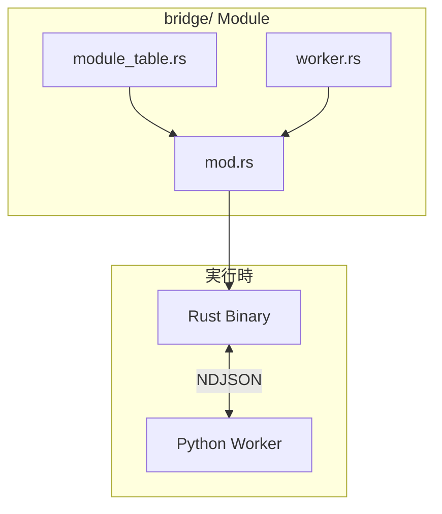

# Tsuchinoko システム設計書

> **著者**: Tane Channel Technology  
> **バージョン**: 1.6.0  
> **最終更新**: 2026-01-10

---

## 1. システム概要

Tsuchinokoは、型ヒント付きPythonコードをRustコードへ変換するトランスパイラである。
Rust + pestで実装し、単一バイナリとして配布可能。

### 1.1 設計思想

> **たねちゃんの哲学**
> - Python = 処理を記述する言語
> - Rust = 構造を記述する言語

この思想に基づき、Pythonの処理記述を解析し、Rustの構造的なコードへ変換する。

---

## 2. アーキテクチャ

### 2.1 全体構成


### 2.2 処理パイプライン

| Phase | モジュール | 入力 | 出力 | 説明 |
|-------|-----------|------|------|------|
| 1 | Lexer | ソースコード | トークン列 | 字句解析 |
| 2 | Parser | トークン列 | Parse Tree | pest文法でパース |
| 3 | AST Builder | Parse Tree | AST | 抽象構文木構築 |
| 4 | Semantic | AST | Typed AST | 型推論・スコープ解決 |
| 5 | IR Generator | Typed AST | IR | 中間表現生成 |
| 6 | Emitter | IR | Rust Code | コード出力 |

---

## 3. モジュール構成

### 3.1 ディレクトリ構造

```
tsuchinoko/
├── Cargo.toml
├── src/
│   ├── main.rs              # CLIエントリポイント
│   ├── lib.rs               # ライブラリルート
│   ├── lexer/
│   │   ├── mod.rs
│   │   └── token.rs         # トークン定義
│   ├── parser/
│   │   ├── mod.rs
│   │   ├── python.pest      # Python文法定義
│   │   └── ast.rs           # AST構造体
│   ├── semantic/
│   │   ├── mod.rs
│   │   ├── scope.rs         # スコープ管理
│   │   ├── types.rs         # 型システム
│   │   └── inference.rs     # 型推論
│   ├── ir/
│   │   ├── mod.rs
│   │   └── nodes.rs         # IR構造体
│   ├── emitter/
│   │   ├── mod.rs
│   │   └── rust.rs          # Rust出力
│   ├── bridge/              # V1.2.0: Import ブリッジ
│   │   ├── mod.rs           # PythonBridge ランタイム
│   │   ├── module_table.rs  # 方式選択テーブル
│   │   ├── worker.rs        # 埋め込み Python ワーカー
│   │   └── tsuchinoko_error.rs  # V1.5.2: エラー型定義
│   └── error.rs             # エラー定義
├── tests/
│   ├── lexer_tests.rs
│   ├── parser_tests.rs
│   ├── semantic_tests.rs
│   └── integration_tests.rs
└── examples/
    └── sample.py            # サンプル入力
```

### 3.2 コンポーネント図


### 3.3 bridge モジュール（V1.2.0）

import 文を含む Python コードを Rust で動作させるためのトリプルハイブリッド方式。



#### 方式選択（target 単位）

| 方式 | 判定条件 | 生成コード例 |
|------|----------|--------------|
| Native | `Native` 登録 | `(x as f64).sqrt()` |
| PyO3 | `PyO3` 登録（検証済み関数のみ） | `py.call_method0("sqrt")` |
| Resident | **未登録（fallback）** | `py_bridge.call("math.sqrt", &[x])` |

#### fallback 対象

| 対象 | 例 |
|------|-----|
| 未知の import | `import obscure_library` |
| 未サポート構文 | `eval()`, 動的属性 |

### 3.4 V1.4.0 新機能

#### 外部ライブラリ自動検出

V1.4.0 では、`numpy`/`pandas` のハードコード判定を削除し、ネイティブモジュール以外はすべて外部ライブラリとして扱う。

```rust
// src/semantic/analyze_statements.rs
const NATIVE_MODULES: &[&str] = &["math", "typing", "dataclasses", "typing_extensions"];

// NATIVE_MODULES にないモジュールは外部ライブラリとして登録
if !NATIVE_MODULES.contains(&module.as_str()) {
    self.external_imports.push((module.clone(), effective_name.clone()));
}
```

#### `from module import func` 構文

```python
from numpy import mean, std
result = mean(values)  # → py_bridge.call_json("numpy.mean", ...)
```

#### math 定数の Native 変換

| Python | Rust |
|--------|------|
| `math.pi` | `std::f64::consts::PI` |
| `math.e` | `std::f64::consts::E` |
| `math.tau` | `std::f64::consts::TAU` |
| `math.inf` | `f64::INFINITY` |
| `math.nan` | `f64::NAN` |

#### `--project` オプション強制

外部ライブラリを使用するコードは `--project` オプションが必須。

```bash
# エラーメッセージが表示される
$ tnk script_with_numpy.py
Error: This code uses external Python libraries.
       Please use --project option to generate a complete project.

# 正しい使い方
$ tnk script_with_numpy.py --project ./output
```

### 3.5 V1.5.2 3層エラーハンドリング・アーキテクチャ

Python の例外機構を Rust で正しく変換するための包括的なエラーハンドリング設計。

#### アーキテクチャ概要


#### 守備範囲マトリクス

| 種類 | 例 | 第1層 | 第2層 | 第3層 |
|------|-----|:---:|:---:|:---:|
| Python例外 | ValueError, TypeError | ◎ | ◎ | △ |
| raise / raise from | 例外チェーン | ◎ | ◎ | × |
| try/except/else/finally | 制御構造 | ◎ | △ | △ |
| 外部呼び出し失敗 | import失敗/属性なし | ◎ | ◎ | △ |
| 生成物のバグpanic | unwrap/OOB/todo | × | × | ◎ |

※ ◎=主戦場 / △=副次的に効く / ×=対象外

#### TsuchinokoError 型

```rust
pub struct TsuchinokoError {
    kind: String,           // "ValueError", "RuntimeError" など
    message: String,        // エラーメッセージ
    line: usize,            // Python ソース行番号
    cause: Option<Box<TsuchinokoError>>,  // 例外チェーン
}
```

#### 2パス may_raise 解析

関数が `may_raise=true` かどうかを2パスで解析:

1. **第1パス (forward_declare_functions)**: 各関数の `raise` 文を直接検出
2. **伝播ループ**: `may_raise=true` 関数を呼ぶ関数も `may_raise=true` に昇格


#### 呼び出し側からの List 型推論

`def f(nums: list)` のような型ヒントなしパラメータを、呼び出し側の引数から推論。

```python
def find_first_even(nums: list) -> int:  # nums: list (Unknown)
    ...

find_first_even([1, 2, 3])  # 呼び出し側: [i64]
```

↓ 2パス解析で推論

```rust
fn find_first_even(nums: &[i64]) -> i64 {
    ...
}
```

---

### 3.6 V1.6.0 OOP & リソース管理

#### クラス継承 → コンポジション

Pythonの継承を Rust のコンポジション（Has-A関係）で表現。


| Python | Rust |
|--------|------|
| `class Dog(Animal):` | `struct Dog { base: Animal, ... }` |
| `super().method()` | `self.base.method()` |
| `self.parent_field` | `self.base.parent_field` |

#### with 文 → RAII スコープ

```python
with open("file.txt") as f:
    content = f.read()
```

↓

```rust
{
    let f = File::open("file.txt")?;
    let content = std::io::read_to_string(&f)?;
}  // Drop で自動解放
```

#### isinstance → DynamicValue enum

```python
if isinstance(x, str):
    return x.upper()
elif isinstance(x, int):
    return x * 2
```

↓

```rust
enum DynamicValue {
    Str(String),
    Int(i64),
}

match x {
    DynamicValue::Str(v) => v.to_uppercase(),
    DynamicValue::Int(v) => v * 2,
}
```

---


## 4. データ構造

### 4.1 トークン

```rust
#[derive(Debug, Clone, PartialEq)]
pub enum Token {
    // リテラル
    IntLiteral(i64),
    FloatLiteral(f64),
    StringLiteral(String),
    BoolLiteral(bool),
    
    // 識別子・キーワード
    Ident(String),
    Keyword(Keyword),
    
    // 演算子
    Operator(Operator),
    
    // 区切り
    Delimiter(Delimiter),
    
    // インデント
    Indent,
    Dedent,
    Newline,
}
```

### 4.2 AST

```rust
#[derive(Debug, Clone)]
pub enum Expr {
    Literal(Literal),
    Ident(String),
    BinOp { left: Box<Expr>, op: BinOp, right: Box<Expr> },
    UnaryOp { op: UnaryOp, operand: Box<Expr> },
    Call { func: Box<Expr>, args: Vec<Expr> },
    Index { target: Box<Expr>, index: Box<Expr> },
    List(Vec<Expr>),
    Tuple(Vec<Expr>),
    Dict(Vec<(Expr, Expr)>),
}

#[derive(Debug, Clone)]
pub enum Stmt {
    Assign { targets: Vec<String>, value: Expr, type_hint: Option<TypeHint> },
    AugAssign { target: String, op: BinOp, value: Expr },
    FuncDef { name: String, params: Vec<Param>, return_type: Option<TypeHint>, body: Vec<Stmt> },
    If { condition: Expr, then_body: Vec<Stmt>, else_body: Option<Vec<Stmt>> },
    For { target: String, iter: Expr, body: Vec<Stmt> },
    While { condition: Expr, body: Vec<Stmt> },
    Return(Option<Expr>),
    Expr(Expr),
}
```

### 4.3 型システム

```rust
#[derive(Debug, Clone, PartialEq)]
pub enum Type {
    Int,
    Float,
    String,
    Bool,
    List(Box<Type>),
    Tuple(Vec<Type>),
    Dict(Box<Type>, Box<Type>),
    Optional(Box<Type>),
    Func { params: Vec<Type>, ret: Box<Type> },
    Unknown,
}
```

### 4.4 IR

```rust
#[derive(Debug, Clone)]
pub enum IrNode {
    VarDecl { name: String, ty: Type, mutable: bool, init: Option<Box<IrNode>> },
    Assign { target: String, value: Box<IrNode> },
    FuncDecl { name: String, params: Vec<(String, Type)>, ret: Type, body: Vec<IrNode> },
    If { cond: Box<IrNode>, then_block: Vec<IrNode>, else_block: Option<Vec<IrNode>> },
    For { var: String, iter: Box<IrNode>, body: Vec<IrNode> },
    While { cond: Box<IrNode>, body: Vec<IrNode> },
    Return(Option<Box<IrNode>>),
    Expr(IrExpr),
}
```

---

## 5. pest文法設計

### 5.1 基本構造

```pest
// python.pest - Phase 1 文法

program = { SOI ~ statement* ~ EOI }

statement = {
    func_def |
    if_stmt |
    for_stmt |
    while_stmt |
    assign_stmt |
    expr_stmt |
    return_stmt
}

func_def = {
    "def" ~ ident ~ "(" ~ param_list? ~ ")" ~ type_annotation? ~ ":" ~ block
}

if_stmt = {
    "if" ~ expr ~ ":" ~ block ~ elif_clause* ~ else_clause?
}

for_stmt = {
    "for" ~ ident ~ "in" ~ expr ~ ":" ~ block
}

assign_stmt = {
    target ~ type_annotation? ~ "=" ~ expr
}

expr = { comparison }
comparison = { arith ~ (comp_op ~ arith)* }
arith = { term ~ (add_op ~ term)* }
term = { factor ~ (mul_op ~ factor)* }
factor = { unary_op? ~ primary }
primary = { literal | ident | "(" ~ expr ~ ")" | list | call }

// 型ヒント
type_annotation = { ":" ~ type_expr }
type_expr = { ident ~ ("[" ~ type_expr ~ "]")? }

// トークン
ident = @{ ASCII_ALPHA ~ (ASCII_ALPHANUMERIC | "_")* }
int_literal = @{ ASCII_DIGIT+ }
float_literal = @{ ASCII_DIGIT+ ~ "." ~ ASCII_DIGIT+ }
string_literal = @{ "\"" ~ (!"\"" ~ ANY)* ~ "\"" }

WHITESPACE = _{ " " | "\t" }
COMMENT = _{ "#" ~ (!NEWLINE ~ ANY)* }
```

---

## 6. 変換ルール

### 6.1 型マッピング

| Python型ヒント | Rust型 |
|---------------|--------|
| `int` | `i64` |
| `float` | `f64` |
| `str` | `String` |
| `bool` | `bool` |
| `list[T]` | `Vec<T>` |
| `tuple[T, U]` | `(T, U)` | 型ヒント必須 |
| `dict[K, V]` | `HashMap<K, V>` | |
| `Optional[T]` | `Option<T>` | |
| `None` | `()` | |

### 6.2 構文マッピング

| Python | Rust |
|--------|------|
| `def func(x: int) -> int:` | `fn func(x: i64) -> i64 {` |
| `x: int = 10` | `let x: i64 = 10;` |
| `x = 10` | `x = 10;` |
| `if cond:` | `if cond {` |
| `for i in range(n):` | `for i in 0..n {` |
| `for item in items:` | `for item in items.iter() {` |
| `while cond:` | `while cond {` |
| `return x` | `return x;` |

### 6.3 シーケンス図


---

## 7. エラーハンドリング

### 7.1 エラー種別

```rust
#[derive(Debug, thiserror::Error)]
pub enum TsuchinokoError {
    #[error("Parse error at line {line}: {message}")]
    ParseError { line: usize, message: String },
    
    #[error("Type error: {message}")]
    TypeError { message: String },
    
    #[error("Undefined variable: {name}")]
    UndefinedVariable { name: String },
    
    #[error("Unsupported syntax: {syntax}")]
    UnsupportedSyntax { syntax: String },
    
    #[error("IO error: {0}")]
    IoError(#[from] std::io::Error),
}
```

---

## 8. 依存クレート

| クレート | バージョン | 用途 |
|---------|-----------|------|
| pest | 2.x | PEGパーサー |
| pest_derive | 2.x | 文法マクロ |
| clap | 4.x | CLI引数解析 |
| thiserror | 1.x | エラー定義 |
| anyhow | 1.x | エラー伝播 |

---

## 9. 非機能要件対応

| NFR-ID | 対応方法 |
|--------|----------|
| PERF-001 | Rustネイティブ速度、ゼロコピーパース |
| REL-001 | thiserrorで構造化エラー、行番号付き |
| MAIN-001 | モジュール分離、pest文法分離 |
| USA-001 | clap使用、--help自動生成 |
| TEST-001 | cargo test + tarpaulin |

---

## 10. 参考資料

- 旧Python実装: `src_v0.5/`
- 旧ドキュメント: `docs_old/`
- pest公式: https://pest.rs/
