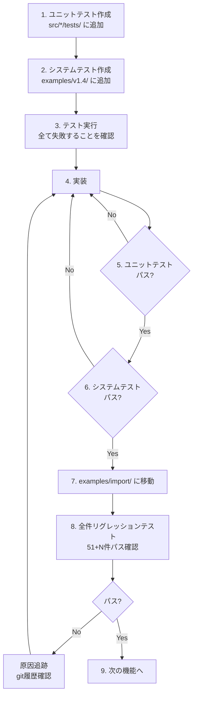

# Tsuchinoko v1.4.0 実行プラン

> **著者**: Tane Channel Technology  
> **作成日**: 2026-01-04  
> **バージョン**: 1.4.0

---

## 1. 開発方針

### 1.1 TDD 完全準拠



### 1.2 開発の大原則

| ルール | 内容 |
|--------|------|
| **報告義務** | テスト失敗は必ず報告、隠蔽禁止 |
| **リグレッション** | ビルド成功だけでなく実行確認まで |
| **本質的対応** | 場当たり的対処禁止、時間はたっぷりある |
| **原因追跡** | 問題が出たら git 履歴から追跡 |

### 1.3 Git 運用

| リモート | 用途 |
|----------|------|
| **nas** | 日常開発の本丸 |
| **origin** | 公開用、main と tag のみ |

**ブランチ**: `feature/v1.4.0-external-imports`

---

## 2. テスト戦略

### 2.1 ディレクトリ構成

```
examples/
├── simple/          # 単一ファイルテスト - 45件
├── import/          # プロジェクトテスト - 6件
└── v1.4/            # 【新規】開発中システムテスト置き場
    ├── v1_4_opencv_simple.py
    ├── v1_4_scipy_test.py
    └── ...
```

### 2.2 テスト移動ルール

| 状態 | 配置場所 | 備考 |
|------|----------|------|
| 開発中 | `examples/v1.4/` | 失敗してもOK |
| 完成 | `examples/import/` | リグレッション対象に昇格 |

### 2.3 venv 環境

> [!IMPORTANT]
> **import系モジュールは全てvenv環境下で実行すること**
> - `tnk` コマンド
> - `cargo build`
> - 生成されたバイナリの実行

```bash
# venv有効化
source venv/bin/activate

# 新規モジュール追加時
echo "opencv-python" >> requirements.txt
pip install -r requirements.txt
```

**requirements.txt の場所**: プロジェクトルート

### 2.4 テスト実行コマンド

```bash
# venv有効化（必須）
source venv/bin/activate

# ユニットテスト
cargo test

# 単体システムテスト
cargo run --quiet -- examples/v1.4/v1_4_opencv_simple.py --project /tmp/test_project
cd /tmp/test_project && cargo build --release && ./target/release/test_project

# 全件リグレッションテスト
cd tests && python run_regression_tests.py
```

---

## 3. 実装スケジュール

### Phase 1: コア機能 - 必須

| ID | タスク | 担当テスト | 状態 |
|----|--------|-----------|------|
| 1-1 | pyo3_imports → external_imports リネーム | ユニットテスト | [ ] 未着手 |
| 1-2 | ハードコード削除、汎用検出 | ユニットテスト | [ ] 未着手 |
| 1-3 | --project 強制エラー | システムテスト | [ ] 未着手 |
| 1-4 | OpenCV サンプル作成 | v1_4_opencv_simple.py | [ ] 未着手 |
| - | Phase 1 リグレッション | 51件 + α | [ ] 未着手 |

### Phase 2: from import 対応 - 推奨

| ID | タスク | 担当テスト | 状態 |
|----|--------|-----------|------|
| 2-1 | from import 構文解析 | ユニットテスト | [ ] 未着手 |
| 2-2 | from import 変換実装 | システムテスト | [ ] 未着手 |
| - | Phase 2 リグレッション | 51件 + α | [ ] 未着手 |

### Phase 3: 検証・拡張 - 推奨

| ID | タスク | 担当テスト | 状態 |
|----|--------|-----------|------|
| 3-1 | PyO3 + VENV 検証 | 手動検証 | [ ] 未着手 |
| 3-2 | Native ホワイトリスト拡充 | ユニットテスト | [ ] 未着手 |
| - | Phase 3 リグレッション | 51件 + α | [ ] 未着手 |

### Phase 4: ドキュメント・完了 - 必須

| ID | タスク | 担当テスト | 状態 |
|----|--------|-----------|------|
| 4-1 | -o オプション動作確認 | 手動確認 | [ ] 未着手 |
| 4-2 | supported_features.md 更新 | レビュー | [ ] 未着手 |
| 4-3 | README.md / README_jp.md 更新 | レビュー | [ ] 未着手 |
| 4-4 | requirements.md に v1.4.0 統合 | レビュー | [ ] 未着手 |
| 4-5 | CHANGELOG 更新 | レビュー | [ ] 未着手 |
| - | 最終リグレッション | 全件 | [ ] 未着手 |

---

## 4. チェックリスト

### 各フェーズ完了時

- [ ] 全ユニットテストパス
- [ ] 全システムテストパス
- [ ] 全件リグレッションテストパス - 51件 + 新規
- [ ] `cargo fmt --all -- --check` パス
- [ ] `cargo clippy --all-targets --all-features -- -D warnings` パス

### リリース前

- [ ] feature ブランチを main にマージ - `--no-ff`
- [ ] nas に push
- [ ] タグ付け `v1.4.0`
- [ ] origin に push - `--follow-tags`

---

## 5. 受入条件 - 最終チェック

| ID | 条件 | 検証方法 | 状態 |
|----|------|----------|------|
| A-01 | `import cv2` が自動的に認識される | システムテスト | [ ] |
| A-02 | `cv2.VideoCapture()` が正しく変換される | システムテスト | [ ] |
| A-03 | 外部ライブラリ + `-o` でエラー出力 | システムテスト | [ ] |
| A-04 | リグレッションテスト 51件パス | リグレッション | [ ] |
| A-05 | 新規サンプルが動作 | システムテスト | [ ] |
| A-06 | ドキュメント更新完了 | レビュー | [ ] |

---

## 6. 備考

### 開発環境

- **venv**: 必須 - PyO3/Resident Worker 動作に必要
- **OpenCV**: テスト用にインストール推奨

### 参考ドキュメント

- [v1.4.0 要件定義書](v1.4.0_requirements.md)
- [システム設計書](system-design.md)
- [API仕様書](api-spec.md)
