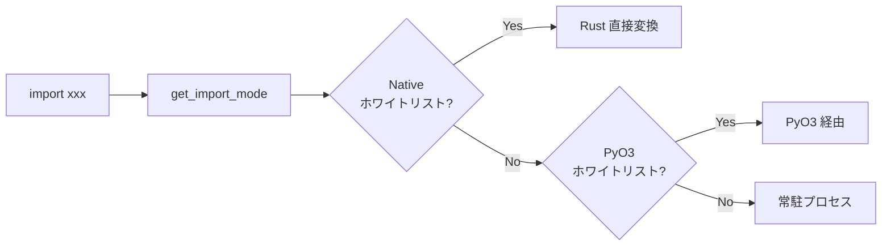
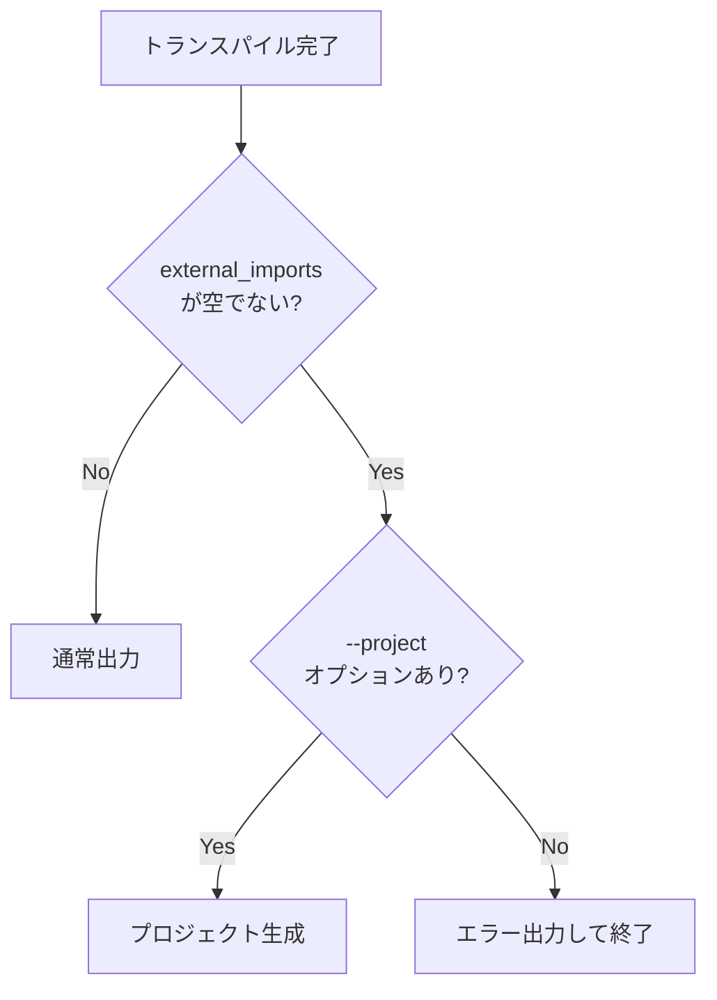
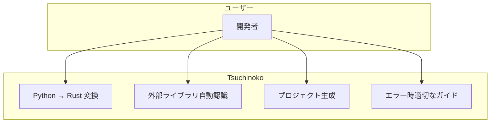

# Tsuchinoko v1.4.0 要件定義書

> **著者**: Tane Channel Technology  
> **バージョン**: 1.4.0  
> **最終更新**: 2026-01-04  
> **コードネーム**: 外部ライブラリ汎用対応

---

## 1. 概要

v1.4.0 では、numpy/pandas 以外の外部 Python ライブラリを自動的に常駐プロセス経由で呼び出せるように拡張する。

### 1.1 現状の問題

| 問題 | 詳細 |
|------|------|
| 外部モジュール認識不足 | `import cv2` が認識されず、無効な Rust コードが出力される |
| ハードコード依存 | numpy/pandas のみ `if module == "numpy" \|\| module == "pandas"` で対応 |
| 変数名の乖離 | `pyo3_imports` が実態と合っていない |
| 不完全なエラー処理 | 外部ライブラリ使用時に `-o` だけでコンパイル不可能なコードが出力される |

### 1.2 目標

- 任意の外部 Python ライブラリが自動的に動作する
- PyO3 + VENV 環境での動作検証
- コードの可読性向上
- 安全なエラー処理の実装

---

## 2. 機能要件

### 2.1 外部モジュール自動検出

**ID**: F-140-01  
**優先度**: 必須  
**フェーズ**: Phase 1

- `import xxx` 文で取り込まれたモジュールを自動的に外部モジュールとして認識
- ハードコードを削除し、汎用的な判定方式に変更
- Native ホワイトリストにないモジュールは全て常駐プロセスへ

**処理フロー**:



### 2.2 変数リネーム

**ID**: F-140-02  
**優先度**: 必須  
**フェーズ**: Phase 1

| 旧名 | 新名 | 説明 |
|------|------|------|
| `pyo3_imports` | `external_imports` | 外部モジュールインポート一覧 |

**変更対象ファイル**:
- `src/semantic/mod.rs`
- `src/semantic/analyze_statements.rs`
- `src/semantic/analyze_expressions.rs`
- `src/semantic/analyze_types.rs`
- `src/semantic/type_infer.rs`
- `src/emitter/mod.rs`

### 2.3 from import 対応

**ID**: F-140-03  
**優先度**: 推奨  
**フェーズ**: Phase 2

`from cv2 import VideoCapture` 形式の import を処理する。

**期待する動作**:

```python
# 入力
from cv2 import VideoCapture
camera = VideoCapture(0)
```

```rust
// 出力
let camera = py_bridge.call_json("cv2.VideoCapture", &[...]).unwrap();
```

### 2.4 PyO3 + VENV 検証

**ID**: F-140-04  
**優先度**: 推奨  
**フェーズ**: Phase 3

- VENV 環境で PyO3 を使用した場合、ctypes 問題が解決されるか検証
- 検証成功時: PyO3 ホワイトリストを有効化
- 検証失敗時: Resident フォールバックを維持、ドキュメントに制限事項記載

**検証対象**:
- numpy.array
- pandas.DataFrame
- cv2.imread

### 2.5 Native ホワイトリスト拡充

**ID**: F-140-05  
**優先度**: 推奨  
**フェーズ**: Phase 3

**現状の Native 対応**:
- `math.sqrt`, `math.sin`, `math.cos`, `math.tan`
- `math.floor`, `math.ceil`, `math.abs`, `math.pow`
- `math.log`, `math.log10`, `math.exp`

**追加候補**:

| Python | Rust | 備考 |
|--------|------|------|
| `math.pi` | `std::f64::consts::PI` | 定数 |
| `math.e` | `std::f64::consts::E` | 定数 |
| `random.random` | `rand::random::<f64>()` | 要 rand クレート |

### 2.6 -o オプションのデフォルト動作

**ID**: F-140-06  
**優先度**: 必須  
**フェーズ**: Phase 4

**現状**: `-o` オプションなしでも動作する

```bash
tnk sample.py  # → sample.rs を出力
```

**確認事項**: 現状の動作で問題なし。ドキュメントに明記。

### 2.7 外部ライブラリ使用時の --project 強制

**ID**: F-140-07  
**優先度**: 必須  
**フェーズ**: Phase 1

**問題**: 外部ライブラリを使用するコードで `-o` のみで単一ファイル出力すると、`bridge` モジュールがないため**コンパイルできないコード**が生成される。

**要件**:
- 外部ライブラリを検出した場合
- `--project` オプションが指定されていなければ**エラーを出力**して終了

**エラーメッセージ例**:

```
Error: This code uses external Python libraries (numpy, pandas).
       Please use --project option to generate a complete project:
       
       tnk sample.py --project ./output_project
```

**処理フロー**:



---

## 3. 非機能要件

| NFR-ID | カテゴリ | 要件 | 検証方法 |
|--------|----------|------|----------|
| PERF-001 | Performance | APIレスポンス 200ms 以内 | pytest-benchmark |
| SEC-001 | Security | シークレット漏洩なし、HTTPS | trivy scan |
| SCL-001 | Scalability | Docker compose scale 対応 | load test |
| NFR-140-01 | 後方互換性 | v1.3.x コードが動作継続 | リグレッションテスト 51件パス |
| NFR-140-02 | テスト | OpenCV サンプル追加 | システムテスト |
| NFR-140-03 | ドキュメント | supported_features.md, README 更新 | レビュー |

---

## 4. ユースケース



---

## 5. 実装計画

### Phase 1: コア機能 - 必須

| 順序 | 内容 | 受入条件 |
|------|------|----------|
| 1-1 | pyo3_imports → external_imports リネーム | 全ユニットテストパス |
| 1-2 | 外部モジュール自動検出 | `import cv2` が認識される |
| 1-3 | --project 強制エラー | 外部ライブラリ使用時に `-o` だけでエラー |

### Phase 2: from import 対応 - 推奨

| 順序 | 内容 | 受入条件 |
|------|------|----------|
| 2-1 | from import 構文解析 | パーサーが `from X import Y` を認識 |
| 2-2 | from import 変換 | `cv2.VideoCapture` として解決 |

### Phase 3: 検証・拡張 - 推奨

| 順序 | 内容 | 受入条件 |
|------|------|----------|
| 3-1 | PyO3 + VENV 検証 | 成功/失敗をドキュメント化 |
| 3-2 | Native ホワイトリスト拡充 | `math.pi`, `math.e` 追加 |

### Phase 4: ドキュメント・完了 - 必須

| 順序 | 内容 | 受入条件 |
|------|------|----------|
| 4-1 | -o オプション動作確認 | ドキュメント明記 |
| 4-2 | ドキュメント更新 | requirements.md に v1.4.0 統合 |
| 4-3 | CHANGELOG 更新 | v1.4.0 エントリ追加 |

---

## 6. リスク

| リスク | 影響度 | 対策 |
|--------|--------|------|
| PyO3 + VENV でも ctypes 問題が解決しない | 中 | Resident フォールバックを維持 |
| 外部モジュール呼び出しの性能低下 | 低 | Native ホワイトリストで重要関数を高速化 |
| OpenCV の GUI 系関数が動かない | 中 | imshow 等はヘッドレス環境では非対応と明記 |
| リグレッション発生 | 高 | TDD + 全件リグレッションテスト |

---

## 7. 受入条件

- [ ] `import cv2` が自動的に認識される
- [ ] `cv2.VideoCapture()` が `py_bridge.call_json(...)` に変換される
- [ ] 外部ライブラリ使用時に `--project` なしでエラーが出力される
- [ ] 既存リグレッションテスト 51件パス
- [ ] 新規 OpenCV サンプルが動作する
- [ ] ドキュメント更新完了
