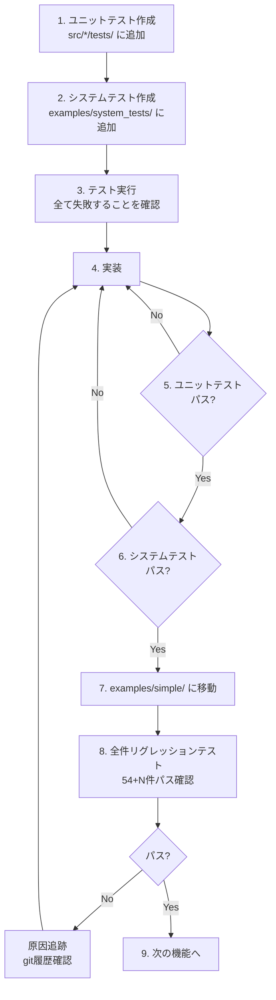

# Tsuchinoko v1.5.0 実行プラン

> **著者**: Tane Channel Technology  
> **作成日**: 2026-01-04  
> **バージョン**: 1.5.0

---

## 1. 開発方針

### 1.1 TDD 完全準拠



### 1.2 開発の大原則

| ルール | 内容 |
|--------|------|
| **報告義務** | テスト失敗は必ず報告、隠蔽禁止 |
| **リグレッション** | ビルド成功だけでなく実行確認まで |
| **本質的対応** | 場当たり的対処禁止、時間はたっぷりある |
| **原因追跡** | 問題が出たら git 履歴から追跡 |

### 1.3 Git 運用

| リモート | 用途 |
|----------|------|
| **nas** | 日常開発の本丸 |
| **origin** | 公開用、main と tag のみ |

**ブランチ**: `feature/v1.5.0-syntax-coverage`

---

## 2. テスト戦略

### 2.1 ディレクトリ構成

```
examples/
├── simple/          # 単一ファイルテスト - 46件
├── import/          # プロジェクトテスト - 8件
└── system_tests/    # 開発中システムテスト置き場
    ├── v1_5_exception_test.py
    ├── v1_5_set_test.py
    ├── v1_5_string_methods_test.py
    └── ...
```

### 2.2 テスト移動ルール

| 状態 | 配置場所 | 備考 |
|------|----------|------|
| 開発中 | `examples/system_tests/` | 失敗してもOK |
| 完成 | `examples/simple/` | リグレッション対象に昇格 |

### 2.3 テスト実行コマンド

```bash
# venv有効化（必須）
source venv/bin/activate

# ユニットテスト
cargo test

# 単体システムテスト（simple対象は -o オプション）
cargo run --quiet -- examples/system_tests/v1_5_exception_test.py -o /tmp/test.rs
rustc /tmp/test.rs -o /tmp/test && /tmp/test

# 全件リグレッションテスト
python tests/run_regression_tests.py
```

---

## 3. 実装スケジュール

### Phase 1: 例外処理の強化

| ID | タスク | 担当テスト | 状態 |
|----|--------|-----------|------|
| EX-001 | 特定例外型 `except ValueError:` | ユニットテスト | [ ] 未着手 |
| EX-002 | 複数例外 `except (TypeError, ValueError):` | ユニットテスト | [ ] 未着手 |
| EX-003 | 例外変数 `except ValueError as e:` | ユニットテスト | [ ] 未着手 |
| EX-004 | finally ブロック | ユニットテスト | [ ] 未着手 |
| EX-005 | raise from | ユニットテスト | [ ] 未着手 |
| - | Phase 1 リグレッション | 54件 + α | [ ] 未着手 |

### Phase 2: 配列関連の強化

#### 2-A: set 型

| ID | タスク | 担当テスト | 状態 |
|----|--------|-----------|------|
| SET-001 | set リテラル `{1, 2, 3}` | ユニットテスト | [ ] 未着手 |
| SET-002 | set() コンストラクタ | ユニットテスト | [ ] 未着手 |
| SET-003 | .add() | ユニットテスト | [ ] 未着手 |
| SET-004 | .remove(), .discard() | ユニットテスト | [ ] 未着手 |
| SET-005 | 集合演算 `|`, `&`, `-` | ユニットテスト | [ ] 未着手 |
| SET-006 | `in` 演算子 | ユニットテスト | [ ] 未着手 |

#### 2-B: list メソッド

| ID | タスク | 担当テスト | 状態 |
|----|--------|-----------|------|
| LST-001 | .pop() | ユニットテスト | [ ] 未着手 |
| LST-002 | .pop(i) | ユニットテスト | [ ] 未着手 |
| LST-003 | .insert(i, x) | ユニットテスト | [ ] 未着手 |
| LST-004 | .remove(x) | ユニットテスト | [ ] 未着手 |
| LST-005 | .extend(iter) | ユニットテスト | [ ] 未着手 |
| LST-006 | .clear() | ユニットテスト | [ ] 未着手 |

#### 2-C: dict メソッド

| ID | タスク | 担当テスト | 状態 |
|----|--------|-----------|------|
| DCT-001 | .keys() | ユニットテスト | [ ] 未着手 |
| DCT-002 | .values() | ユニットテスト | [ ] 未着手 |
| DCT-003 | .get(k) | ユニットテスト | [ ] 未着手 |
| DCT-004 | .get(k, default) | ユニットテスト | [ ] 未着手 |
| DCT-005 | .pop(k) | ユニットテスト | [ ] 未着手 |
| DCT-006 | .update(other) | ユニットテスト | [ ] 未着手 |

| - | Phase 2 リグレッション | 54件 + α | [ ] 未着手 |

### Phase 3: 文字列メソッドの網羅

| ID | タスク | 担当テスト | 状態 |
|----|--------|-----------|------|
| STR-001 | .replace(old, new) | ユニットテスト | [ ] 未着手 |
| STR-002 | .startswith(), .endswith() | ユニットテスト | [ ] 未着手 |
| STR-003 | .find(), .rfind() | ユニットテスト | [ ] 未着手 |
| STR-004 | .isdigit(), .isalpha(), .isalnum() | ユニットテスト | [ ] 未着手 |
| STR-005 | .isupper(), .islower() | ユニットテスト | [ ] 未着手 |
| STR-006 | .zfill(), .ljust(), .rjust(), .center() | ユニットテスト | [ ] 未着手 |
| STR-007 | .count(sub) | ユニットテスト | [ ] 未着手 |
| - | Phase 3 リグレッション | 54件 + α | [ ] 未着手 |

### Phase 4: 組み込み関数の残り

| ID | タスク | 担当テスト | 状態 |
|----|--------|-----------|------|
| BLT-001 | input(), input(prompt) | ユニットテスト | [ ] 未着手 |
| BLT-002 | round(x), round(x, n) | ユニットテスト | [ ] 未着手 |
| BLT-003 | chr(n), ord(c) | ユニットテスト | [ ] 未着手 |
| BLT-004 | bin(x), hex(x), oct(x) | ユニットテスト | [ ] 未着手 |
| - | Phase 4 リグレッション | 54件 + α | [ ] 未着手 |

### Phase 5: スライス完全対応

| ID | タスク | 担当テスト | 状態 |
|----|--------|-----------|------|
| SLC-001 | ステップ指定 `arr[::2]` | ユニットテスト | [ ] 未着手 |
| SLC-002 | 逆順 `arr[::-1]` | ユニットテスト | [ ] 未着手 |
| SLC-003 | 範囲+ステップ `arr[1:10:2]` | ユニットテスト | [ ] 未着手 |
| - | Phase 5 リグレッション | 54件 + α | [ ] 未着手 |

### Phase 6: None / Optional の深い対応

| ID | タスク | 担当テスト | 状態 |
|----|--------|-----------|------|
| OPT-001 | or パターン `x or default` | ユニットテスト | [ ] 未着手 |
| OPT-002 | and 短絡 `x and x.method()` | ユニットテスト | [ ] 未着手 |
| OPT-003 | 三項演算子との組み合わせ | ユニットテスト | [ ] 未着手 |
| - | Phase 6 リグレッション | 54件 + α | [ ] 未着手 |

### Phase 7: ドキュメント・リリース

| ID | タスク | 担当テスト | 状態 |
|----|--------|-----------|------|
| DOC-001 | supported_features.md 更新 | レビュー | [ ] 未着手 |
| DOC-002 | README.md / README_jp.md 更新 | レビュー | [ ] 未着手 |
| DOC-003 | CHANGELOG 更新 | レビュー | [ ] 未着手 |
| DOC-004 | requirements.md に v1.5.0 統合 | レビュー | [ ] 未着手 |
| - | 最終リグレッション | 全件 | [ ] 未着手 |

---

## 4. チェックリスト

### 各フェーズ完了時

- [ ] 全ユニットテストパス
- [ ] 全システムテストパス
- [ ] 全件リグレッションテストパス - 54件 + 新規
- [ ] `cargo fmt --all -- --check` パス
- [ ] `cargo clippy --all-targets --all-features -- -D warnings` パス

### リリース前

- [ ] feature ブランチを main にマージ - `--no-ff`
- [ ] nas に push
- [ ] タグ付け `v1.5.0`
- [ ] origin に push - `--follow-tags`

---

## 5. 受入条件 - 最終チェック

| ID | 条件 | 検証方法 | 状態 |
|----|------|----------|------|
| A-01 | `set()` が `HashSet` に正しく変換される | システムテスト | [ ] |
| A-02 | `try/except ValueError:` が動作する | システムテスト | [ ] |
| A-03 | `s.replace("a", "b")` が動作する | システムテスト | [ ] |
| A-04 | `arr[::-1]` が逆順配列を返す | システムテスト | [ ] |
| A-05 | `x or default` が正しく動作する | システムテスト | [ ] |
| A-06 | リグレッションテスト 54件 + 新規 全パス | リグレッション | [ ] |
| A-07 | Python 構文カバレッジ 80% 達成 | ドキュメント確認 | [ ] |
| A-08 | ドキュメント更新完了 | レビュー | [ ] |

---

## 6. 備考

### 開発環境

- **venv**: 必須 - テスト実行に必要
- **Rust**: 1.70+

### ブランチ作成コマンド

```bash
git checkout main
git pull nas main
git checkout -b feature/v1.5.0-syntax-coverage
```

### 参考ドキュメント

- [v1.5.0 要件定義書](v1.5.0_requirements.md)
- [システム設計書](system-design.md)
- [API仕様書](api-spec.md)

### 実装上の注意点

- **set リテラル `{1, 2, 3}`**: dict リテラル `{k: v}` との区別に注意
- **スライスのステップ**: `.iter().step_by()` を使用、新しい配列を生成
- **例外型のマッピング**: Rust には例外型がないため、panic message で判別するか無視する設計を検討

---

## 7. v1.6.0 への引き継ぎ事項

> [!IMPORTANT]
> 以下は v1.5.0 のスコープ外。v1.6.0 で対応する。

| 項目 | 内容 |
|------|------|
| **標準ライブラリ** | json, re, datetime, os の Native 対応 |
| **外部ライブラリ Top5** | numpy, pandas, scipy, matplotlib, requests の徹底サポート |
| **numpy 100%互換** | 現在は基本的な呼び出しのみ対応 |
