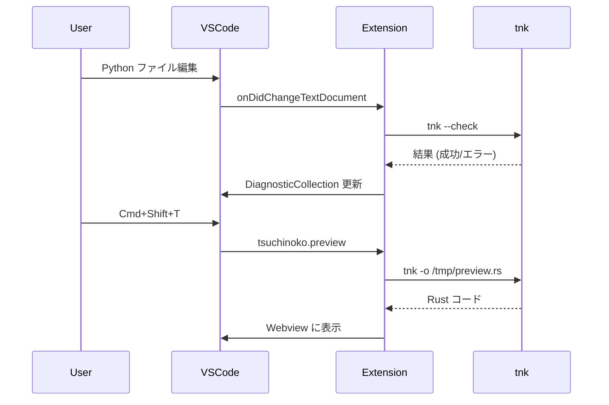

# Tsuchinoko v1.5.1 要件定義書 - VS Code 拡張

> **バージョン**: v1.5.1  
> **作成日**: 2026-01-06  
> **目標リリース**: v1.5.0 完了後

---

## 1. 目的

VS Code 上で Python ファイルを編集しながら、リアルタイムで Rust コードのプレビューと変換可否の診断を行えるようにする。

これにより、開発者は Tsuchinoko の変換結果を即座に確認でき、非対応構文を早期に検出できる。

---

## 2. スコープ

### 2.1 対象機能

| 機能 | 説明 | 優先度 |
|------|------|--------|
| トランスパイルコマンド | `Cmd+Shift+T` で現在のファイルを変換 | 高 |
| Rust プレビュー | サイドパネルに変換結果を表示 | 高 |
| リアルタイム診断 | 非対応構文に波線表示、エラーメッセージ | 中 |
| ステータスバー表示 | 変換可否を表示 (✅/❌) | 低 |

### 2.2 対象外

| 機能 | 理由 |
|------|------|
| Language Server Protocol | v1.6.0 以降で検討 |
| シンタックスハイライト拡張 | Python 標準で十分 |
| デバッガ連携 | スコープ外 |

---

## 3. アーキテクチャ

### 3.1 ディレクトリ構成

```
Tsuchinoko/
├── src/                      # Rust トランスパイラ
├── vscode-extension/         # VS Code 拡張
│   ├── package.json          # マニフェスト
│   ├── tsconfig.json
│   ├── src/
│   │   ├── extension.ts      # エントリポイント
│   │   ├── transpiler.ts     # tnk コマンド呼び出し
│   │   ├── preview.ts        # Webview プレビュー
│   │   └── diagnostics.ts    # 診断機能
│   └── README.md             # 拡張の README
└── docs/
    └── vscode-setup.md       # 導入マニュアル
```

### 3.2 動作フロー



### 3.3 中間ファイル管理

| 項目 | 内容 |
|------|------|
| ディレクトリ | `os.tmpdir()/tsuchinoko/` |
| ファイル名 | `preview_{ハッシュ8桁}.rs` |
| ハッシュ | Python ファイルの絶対パスの MD5 先頭 8 文字 |
| クリーンアップ | 拡張機能 deactivate 時に削除 |

**実装例**:

```typescript
import * as os from 'os';
import * as path from 'path';
import * as crypto from 'crypto';

function getOutputPath(pythonFilePath: string): string {
    const outputDir = path.join(os.tmpdir(), 'tsuchinoko');
    const hash = crypto.createHash('md5')
        .update(pythonFilePath)
        .digest('hex')
        .slice(0, 8);
    return path.join(outputDir, `preview_${hash}.rs`);
}
```

**クリーンアップ**:

```typescript
// extension.ts
import * as fs from 'fs';

function cleanupTempFiles() {
    const outputDir = path.join(os.tmpdir(), 'tsuchinoko');
    if (fs.existsSync(outputDir)) {
        fs.rmSync(outputDir, { recursive: true, force: true });
    }
}

export function activate(context: vscode.ExtensionContext) {
    // 起動時に古い一時ファイルを削除 (前回クラッシュ対策)
    cleanupTempFiles();
    // ...
}

export function deactivate() {
    // 終了時にも削除
    cleanupTempFiles();
}
```

> [!NOTE]
> クリーンアップは **activate (起動時)** と **deactivate (終了時)** の両方で実行する。
> VS Code がクラッシュした場合は deactivate が呼ばれないため、次回起動時に削除する。

---

## 4. 技術仕様

### 4.1 コマンド

| コマンドID | タイトル | キーバインド |
|-----------|----------|------------|
| `tsuchinoko.transpile` | Tsuchinoko: Transpile to Rust | なし |
| `tsuchinoko.preview` | Tsuchinoko: Show Rust Preview | `Cmd+Shift+T` / `Ctrl+Shift+T` |

### 4.2 設定

| 設定ID | 型 | デフォルト | 説明 |
|--------|-----|----------|------|
| `tsuchinoko.tnkPath` | string | `tnk` | tnk コマンドのパス |
| `tsuchinoko.autoCheck` | boolean | `true` | ファイル保存時に自動チェック |
| `tsuchinoko.checkDelay` | number | `500` | チェック実行までの遅延 (ms) |

### 4.3 診断メッセージ

| 診断コード | 重大度 | 説明 |
|-----------|--------|------|
| `TSUCHINOKO001` | Error | パースエラー |
| `TSUCHINOKO002` | Error | 型エラー |
| `TSUCHINOKO003` | Warning | 非対応構文 |

---

## 5. 成功基準

| # | 基準 | 検証方法 |
|---|------|----------|
| 1 | `Cmd+Shift+T` でプレビュー表示 | 手動テスト |
| 2 | 非対応構文にリアルタイムで波線表示 | 手動テスト |
| 3 | エラーメッセージに行番号含む | 手動テスト |
| 4 | `.vsix` ファイル生成可能 | vsce package |
| 5 | VS Code にインストール可能 | code --install-extension |

---

## 6. 変更対象ファイル

### 新規作成

| ファイル | 内容 |
|----------|------|
| `vscode-extension/package.json` | マニフェスト |
| `vscode-extension/tsconfig.json` | TypeScript 設定 |
| `vscode-extension/src/extension.ts` | エントリポイント |
| `vscode-extension/src/transpiler.ts` | tnk 呼び出し |
| `vscode-extension/src/preview.ts` | プレビュー機能 |
| `vscode-extension/src/diagnostics.ts` | 診断機能 |
| `vscode-extension/README.md` | 拡張 README |
| `docs/vscode-setup.md` | 導入マニュアル |

### 変更

| ファイル | 内容 |
|----------|------|
| `.gitignore` | node_modules/, out/, *.vsix 追加 |
| `README.md` | VS Code 拡張セクション追加 |

---

## 7. スケジュール

| 日 | 作業内容 |
|----|----------|
| 1 | プロジェクト足場作成、基本コマンド実装 |
| 2 | プレビュー機能実装 |
| 3 | リアルタイム診断実装 |
| 4 | ドキュメント作成、テスト |
| 5 | パッケージ化、リリース準備 |

---

## 8. リスク

| リスク | 対策 |
|--------|------|
| tnk コマンドが見つからない | 設定でパス指定可能に |
| 大きなファイルで遅延 | debounce 処理、遅延設定 |
| Windows 対応 | パス区切り文字に注意 |

---

## 9. 導入マニュアル概要

1. **ビルド済み拡張のインストール**
   ```bash
   code --install-extension tsuchinoko-0.1.0.vsix
   ```

2. **ソースからビルド**
   ```bash
   cd vscode-extension
   npm install
   npm run compile
   vsce package
   ```

3. **使い方**
   - Python ファイルを開く
   - `Cmd+Shift+T` でプレビュー表示
   - 非対応構文は波線で表示
