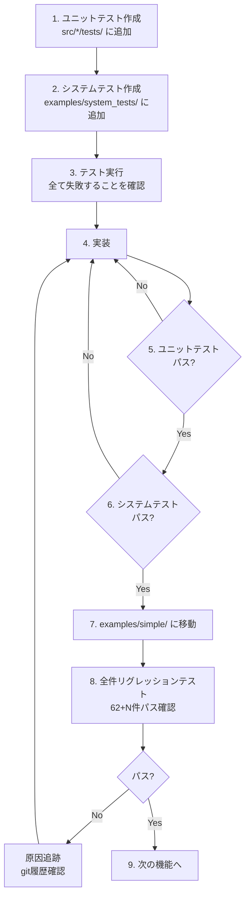

# Tsuchinoko v1.5.2 実行プラン

> **著者**: Tane Channel Technology  
> **作成日**: 2026-01-06  
> **バージョン**: 1.5.2

---

## 1. 開発方針

### 1.1 TDD 完全準拠



### 1.2 開発の大原則

| ルール | 内容 |
|--------|------|
| **報告義務** | テスト失敗は必ず報告、隠蔽禁止 |
| **リグレッション** | ビルド成功だけでなく実行確認まで |
| **本質的対応** | 場当たり的対処禁止、時間はたっぷりある |
| **原因追跡** | 問題が出たら git 履歴から追跡 |

### 1.3 Git 運用

| リモート | 用途 |
|----------|------|
| **nas** | 日常開発の本丸 |
| **origin** | 公開用、main と tag のみ |

**ブランチ**: `feature/v1.5.2-result-type`

---

## 2. テスト戦略

### 2.1 ディレクトリ構成

```
examples/
├── simple/          # 単一ファイルテスト - 54件
├── import/          # プロジェクトテスト - 8件
├── interactive/     # 対話型テスト - 1件 (input等)
└── system_tests/    # 開発中システムテスト置き場
    ├── v1_5_2_raise_from_test.py
    ├── v1_5_2_try_else_test.py
    └── ...

tmp/                 # 一時ファイル置き場 (git ignore)
```

### 2.2 テスト移動ルール

| 状態 | 配置場所 | 備考 |
|------|----------|------|
| 開発中 | `examples/system_tests/` | 失敗してもOK |
| 完成 | `examples/simple/` | リグレッション対象に昇格 |

### 2.3 テスト実行コマンド

```bash
# venv有効化（必須）
source venv/bin/activate

# ユニットテスト
cargo test

# 単体システムテスト (出力先は tmp/ 配下)
cargo run --quiet -- examples/system_tests/v1_5_2_raise_from_test.py -o tmp/test.rs
rustc tmp/test.rs -o tmp/test && tmp/test

# 全件リグレッションテスト
python tests/run_regression_tests.py

# CI/CD 事前チェック (必須)
cargo fmt --all -- --check
cargo clippy --all-targets --all-features -- -D warnings

# CI/CD ステータス確認 (gh CLI)
gh run list --limit 5
gh run view --log  # 詳細ログ確認

# カバレッジ計測 (tarpaulin)
cargo tarpaulin --out Html --output-dir tmp/coverage
```

---

## 3. 実装スケジュール

### Phase 1: raise from 構文

| ID | タスク | 担当テスト | 状態 |
|----|--------|-----------|------|
| RF-001 | AST に `Stmt::Raise.cause` 追加 | ユニットテスト | [ ] 未着手 |
| RF-002 | パーサー: `raise ... from ...` 対応 | ユニットテスト | [ ] 未着手 |
| RF-003 | IR に `IrNode::Raise.cause` 追加 | ユニットテスト | [ ] 未着手 |
| RF-004 | Emitter: エラーチェーン出力 | ユニットテスト | [ ] 未着手 |
| - | Phase 1 リグレッション | 62件 + α | [ ] 未着手 |

### Phase 2: try/except/else ブロック

| ID | タスク | 担当テスト | 状態 |
|----|--------|-----------|------|
| TE-001 | AST に `Stmt::TryExcept.else_body` 追加 | ユニットテスト | [ ] 未着手 |
| TE-002 | パーサー: else ブロック対応 | ユニットテスト | [ ] 未着手 |
| TE-003 | Semantic: else ブロック解析 | ユニットテスト | [ ] 未着手 |
| TE-004 | Emitter: else ブロック出力 | ユニットテスト | [ ] 未着手 |
| - | Phase 2 リグレッション | 62件 + α | [ ] 未着手 |

### Phase 3: Result 型への統一 (オプション)

> [!NOTE]
> 複雑度が高いため、v1.6.0 に延期する可能性あり

| ID | タスク | 担当テスト | 状態 |
|----|--------|-----------|------|
| RS-001 | TsuchinokoError 型定義 | ユニットテスト | [ ] 未着手 |
| RS-002 | 関数の戻り値型を Result に変換 | ユニットテスト | [ ] 未着手 |
| RS-003 | try/except を match に変換 | ユニットテスト | [ ] 未着手 |
| - | Phase 3 リグレッション | 62件 + α | [ ] 未着手 |

### Phase 4: ドキュメント・リリース

| ID | タスク | 担当テスト | 状態 |
|----|--------|-----------|------|
| DOC-001 | supported_features.md 更新 | レビュー | [ ] 未着手 |
| DOC-002 | README.md / README_jp.md 更新 | レビュー | [ ] 未着手 |
| DOC-003 | CHANGELOG 更新 | レビュー | [ ] 未着手 |
| DOC-004 | requirements.md に v1.5.2 統合 | レビュー | [ ] 未着手 |
| - | 最終リグレッション | 全件 | [ ] 未着手 |

---

## 4. チェックリスト

### 各フェーズ完了時

- [ ] 全ユニットテストパス
- [ ] 全システムテストパス
- [ ] 全件リグレッションテストパス - 62件 + 新規
- [ ] `cargo fmt --all -- --check` パス
- [ ] `cargo clippy --all-targets --all-features -- -D warnings` パス

### リリース前 (順序重要)

> [!CAUTION]
> CI/CD 通過確認後にタグ付けすること。タグ付け後に修正が必要になった場合はタグ削除・再作成が必要。

1. [ ] `cargo clippy --all-targets --all-features -- -D warnings` パス
2. [ ] feature ブランチを main にマージ - `--no-ff`
3. [ ] nas に push
4. [ ] origin に push
5. [ ] **GitHub Actions CI/CD 通過を確認**
6. [ ] タグ付け `v1.5.2`
7. [ ] nas にタグ push
8. [ ] origin にタグ push
9. [ ] **nas の feature ブランチを削除**
10. [ ] **ローカルの feature ブランチを削除**

---

## 5. 受入条件 - 最終チェック

| ID | 条件 | 検証方法 | 状態 |
|----|------|----------|------|
| A-01 | `raise A from B` 構文がパースできる | パーサーテスト | [ ] |
| A-02 | 生成コードに原因情報が含まれる | 生成 Rust コード確認 | [ ] |
| A-03 | エラー表示に原因チェーンが出る | 実行時出力確認 | [ ] |
| A-04 | `try/except/else` がパース・変換できる | システムテスト | [ ] |
| A-05 | リグレッションテスト 62件 + 新規 全パス | リグレッション | [ ] |
| A-06 | ドキュメント更新完了 | レビュー | [ ] |

---

## 6. 備考

### 開発環境

- **venv**: 必須 - テスト実行に必要
- **Rust**: 1.70+

### ブランチ作成コマンド

```bash
git checkout main
git pull nas main
git checkout -b feature/v1.5.2-result-type
```

### 参考ドキュメント

- [v1.5.2 要件定義書](v1.5.2_requirements.md)
- [システム設計書](system-design.md)
- [API仕様書](api-spec.md)

### 実装上の注意点

- **raise from**: AST → IR → Emitter の全レイヤーで cause を伝播
- **try/except/else**: else は正常終了時のみ実行される点に注意
- **Result 型統一**: 既存コードへの影響が大きいため慎重に検討

---

## 7. v1.6.0 への引き継ぎ事項

> [!IMPORTANT]
> 以下は v1.5.2 のスコープ外。v1.6.0 で対応する。

| 項目 | 内容 |
|------|------|
| **完全な traceback 再現** | Python と同等のスタックトレース |
| **カスタム例外クラス** | ユーザー定義例外の対応 |
| **標準ライブラリ** | json, re, datetime, os の Native 対応 |
