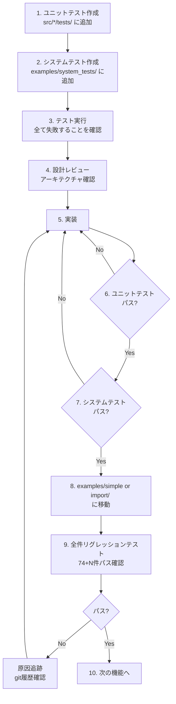
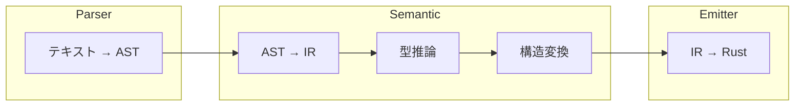

# Tsuchinoko v1.6.0 実行プラン

> **著者**: Tane Channel Technology  
> **作成日**: 2026-01-08  
> **バージョン**: 1.6.0

---

## 1. 開発方針

### 1.1 アーキテクチャ原則

> [!IMPORTANT]
> v1.6.0 では以下の原則を徹底する。

| 原則 | 内容 |
|------|------|
| **Semantic 責務** | Python to Rust の構造変換は Semantic で行う。Emitter で場当たり的対処をしない |
| **俯瞰的設計** | システム全体を見て改訂を抽象化し、保守性・可読性・バグの出にくさを保つ |
| **構造優先** | Python の「処理」を Rust の「構造」に変換する |
| **動作優先** | 「動かなければ意味がない」- 理想より動作を優先 |

### 1.2 TDD 完全準拠



### 1.3 開発の大原則

| ルール | 内容 |
|--------|------|
| **報告義務** | テスト失敗は必ず報告、隠蔽禁止 |
| **リグレッション** | ビルド成功だけでなく実行確認まで |
| **本質的対応** | 場当たり的対処禁止、時間はたっぷりある |
| **原因追跡** | 問題が出たら git 履歴から追跡 |
| **設計先行** | 実装前にアーキテクチャを検討する |

### 1.4 Git 運用

| リモート | 用途 |
|----------|------|
| **nas** | 日常開発の本丸 |
| **origin** | 公開用、main と tag のみ |

**ブランチ**: `feature/v1.6.0-coverage-expansion`

---

## 2. テスト戦略

### 2.1 ディレクトリ構成

```
examples/
├── simple/          # 単一ファイルテスト - 48件
├── import/          # プロジェクトテスト - 26件
├── interactive/     # 対話型テスト - 1件 (input等)
└── system_tests/    # 開発中システムテスト置き場
    ├── v1_6_0_with_test.py
    ├── v1_6_0_inheritance_test.py
    ├── v1_6_0_property_test.py
    └── ...

tmp/                 # 一時ファイル置き場 (git ignore)
```

### 2.2 テスト移動ルール

| 状態 | 配置場所 | 備考 |
|------|----------|------|
| 開発中 | `examples/system_tests/` | 失敗してもOK |
| 完成 | `examples/simple/` | リグレッション対象に昇格 |

### 2.3 テスト実行コマンド

```bash
# venv有効化（必須）
source venv/bin/activate

# ユニットテスト
cargo test

# 単体システムテスト (出力先は tmp/ 配下)
cargo run --quiet -- examples/system_tests/v1_6_0_with_test.py -o tmp/test.rs
rustc tmp/test.rs -o tmp/test && tmp/test

# 全件リグレッションテスト
python tests/run_regression_tests.py

# CI/CD 事前チェック (必須)
cargo fmt --all -- --check
cargo clippy --all-targets --all-features -- -D warnings

# CI/CD ステータス確認 (gh CLI)
gh run list --limit 5
gh run view --log  # 詳細ログ確認

# カバレッジ計測 (tarpaulin)
cargo tarpaulin --out Html --output-dir tmp/coverage
```

---

## 3. 実装スケジュール

### Phase 1: バグ修正・小規模機能

| ID | タスク | 担当テスト | 状態 |
|----|--------|-----------|------|
| FT-009 | IndexAssign 二重キャスト修正 | bubbleSort | [ ] 未着手 |
| FT-007 | 連鎖比較 (`a < b < c`) | ユニットテスト | [ ] 未着手 |
| FT-004 | セット内包表記 | ユニットテスト | [ ] 未着手 |
| - | Phase 1 リグレッション | 74件 + α | [ ] 未着手 |

### Phase 2: PyO3・プロパティ

| ID | タスク | 担当テスト | 状態 |
|----|--------|-----------|------|
| FT-008 | PyO3 タプルアンパッキング | OpenCV テスト | [ ] 未着手 |
| FT-003 | `@property` デコレータ | システムテスト | [ ] 未着手 |
| - | Phase 2 リグレッション | 74件 + α | [ ] 未着手 |

### Phase 3: 動的機能

| ID | タスク | 担当テスト | 状態 |
|----|--------|-----------|------|
| FT-006 | `**kwargs` 対応 | システムテスト | [ ] 未着手 |
| - | Phase 3 リグレッション | 74件 + α | [ ] 未着手 |

### Phase 4: with 文

| ID | タスク | 担当テスト | 状態 |
|----|--------|-----------|------|
| FT-001 | `with` 文 (RAII) | システムテスト | [ ] 未着手 |
| - | Phase 4 リグレッション | 74件 + α | [ ] 未着手 |

### Phase 5: クラス継承 (大規模)

> [!CAUTION]
> 最も影響範囲が大きい。段階的に実装し、各ステップでリグレッション確認。

| ID | タスク | 担当テスト | 状態 |
|----|--------|-----------|------|
| FT-002-1 | AST に `ClassDef.bases` 追加 | ユニットテスト | [ ] 未着手 |
| FT-002-2 | パーサー: `class Child(Parent):` 対応 | ユニットテスト | [ ] 未着手 |
| FT-002-3 | Semantic: コンポジション構造生成 | ユニットテスト | [ ] 未着手 |
| FT-002-4 | Emitter: 委譲メソッド生成 | ユニットテスト | [ ] 未着手 |
| FT-002-5 | システムテスト統合 | 継承テスト | [ ] 未着手 |
| - | Phase 5 リグレッション | 74件 + α | [ ] 未着手 |

### Phase 6: isinstance (複雑)

| ID | タスク | 担当テスト | 状態 |
|----|--------|-----------|------|
| FT-005-1 | DynamicValue enum 定義 | ユニットテスト | [ ] 未着手 |
| FT-005-2 | isinstance 呼び出し検出 | ユニットテスト | [ ] 未着手 |
| FT-005-3 | 関数引数の enum 化 | ユニットテスト | [ ] 未着手 |
| FT-005-4 | match 式への変換 | ユニットテスト | [ ] 未着手 |
| - | Phase 6 リグレッション | 74件 + α | [ ] 未着手 |

### Phase 7: ドキュメント・リリース

| ID | タスク | 担当テスト | 状態 |
|----|--------|-----------|------|
| DOC-001 | supported_features.md 更新 | レビュー | [ ] 未着手 |
| DOC-002 | unsupported_features.md 更新 | レビュー | [ ] 未着手 |
| DOC-003 | README.md / README_jp.md 更新 | レビュー | [ ] 未着手 |
| DOC-004 | CHANGELOG 更新 | レビュー | [ ] 未着手 |
| DOC-005 | カバレッジ % 更新 | レビュー | [ ] 未着手 |
| - | 最終リグレッション | 全件 | [ ] 未着手 |

---

## 4. アーキテクチャ設計ガイド

### 4.1 レイヤー責務



| レイヤー | 責務 | やってよいこと | やってはいけないこと |
|----------|------|---------------|---------------------|
| **Parser** | テキスト → AST | 構文解析、AST 構築 | 型推論、変換ロジック |
| **Semantic** | AST → IR | 型推論、構造変換、キャスト挿入 | コード生成 |
| **Emitter** | IR → Rust | IR の忠実な出力 | **場当たり的変換** |

### 4.2 v1.6.0 で特に注意すべき点

| 機能 | Semantic の責務 | Emitter の責務 |
|------|-----------------|----------------|
| 継承 → コンポジション | `ClassDef.bases` から `base: Parent` フィールド生成 | struct 出力のみ |
| `@property` | decorator から getter/setter メソッド生成 | メソッド出力のみ |
| IndexAssign キャスト | `IrExpr::Cast { ty: "usize" }` 生成 | `as usize` なし出力 |
| PyO3 タプル展開 | 一時変数 + インデックスアクセス生成 | そのまま出力 |

---

## 5. チェックリスト

### 各フェーズ完了時

- [ ] 全ユニットテストパス
- [ ] 全システムテストパス
- [ ] 全件リグレッションテストパス - 74件 + 新規
- [ ] `cargo fmt --all -- --check` パス
- [ ] `cargo clippy --all-targets --all-features -- -D warnings` パス
- [ ] **アーキテクチャ原則の遵守を確認**

### リリース前 (順序重要)

> [!CAUTION]
> CI/CD 通過確認後にタグ付けすること。タグ付け後に修正が必要になった場合はタグ削除・再作成が必要。

1. [ ] `cargo clippy --all-targets --all-features -- -D warnings` パス
2. [ ] feature ブランチを main にマージ - `--no-ff`
3. [ ] nas に push
4. [ ] origin に push
5. [ ] **GitHub Actions CI/CD 通過を確認**
6. [ ] タグ付け `v1.6.0`
7. [ ] nas にタグ push
8. [ ] origin にタグ push
9. [ ] **nas の feature ブランチを削除**
10. [ ] **ローカルの feature ブランチを削除**

---

## 6. 受入条件 - 最終チェック

| ID | 条件 | 検証方法 | 状態 |
|----|------|----------|------|
| A-01 | `with` 文が RAII で変換される | 生成コード確認 | [ ] |
| A-02 | 継承がコンポジションで動作する | 継承テスト | [ ] |
| A-03 | `@property` が getter/setter に変換される | プロパティテスト | [ ] |
| A-04 | セット内包表記が HashSet に変換される | ユニットテスト | [ ] |
| A-05 | 連鎖比較が && で展開される | ユニットテスト | [ ] |
| A-06 | `**kwargs` が HashMap で動作する | システムテスト | [ ] |
| A-07 | `isinstance` が enum match で動作する | システムテスト | [ ] |
| A-08 | PyO3 タプル展開が正しく動作する | OpenCV テスト | [ ] |
| A-09 | IndexAssign の二重キャストが解消 | bubbleSort テスト | [ ] |
| A-10 | カバレッジ 75% 達成 | ドキュメント確認 | [ ] |
| A-11 | リグレッションテスト 74件 + 新規 全パス | リグレッション | [ ] |
| A-12 | ドキュメント更新完了 | レビュー | [ ] |

---

## 7. 参考ドキュメント

- [v1.6.0 要件定義書](v1.6.0_requirements.md)
- [システム設計書](system-design.md)
- [API仕様書](api-spec.md)

---

## 8. v1.7.0 への引き継ぎ事項

> [!IMPORTANT]
> 以下は v1.6.0 のスコープ外。v1.7.0 で対応する。

| 項目 | 内容 |
|------|------|
| **async/await** | 非同期処理対応 |
| **yield/Generator** | ジェネレータ対応 |
| **多重継承** | 複数基底クラスの継承 |
| **抽象基底クラス** | abc モジュール対応 |
| **@classmethod** | クラスメソッド対応 |
