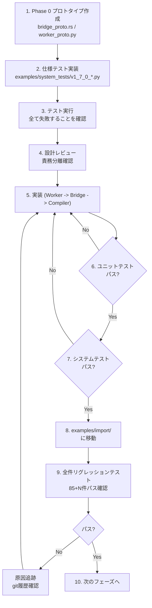

# Tsuchinoko v1.7.0 実行プラン

> **テーマ**: Bridge Revolution - 相互運用性の完成
> **作成日**: 2026-01-10
> **バージョン**: 1.7.0

---

## 1. 開発方針

### 1.0 プロジェクト理念 (The Philosophy)

> **"Pythonは処理を記述する言語。対してRustは構造を記述する言語である。**
> **よって、Tsuchinokoは処理を構造に変換するトランスパイラである。"**

- **Python (Process)**: 実行時の動的な振る舞い、ダックタイピング、フロー。
- **Rust (Structure)**: コンパイル時の静的な型、Trait、所有権、コンポジション。
- **Translation**: 単なる構文変換ではなく、動的な「処理の流れ」から静的な「構造」を導き出し、再構築すること。

### 1.1 アーキテクチャ原則

> [!IMPORTANT]
> v1.7.0 では以下の原則を徹底する。

| 原則 | 内容 |
|------|------|
| **責務分離 (Separation)** | Worker(事実) / Semantic(意味) / Emitter(実装) の境界を死守する |
| **Opaque Handle** | Rust側はHandleの中身を一切解釈しない。透過的に扱う |
| **Late Binding** | `Any` 型は「何でもあり」ではなく「実行時まで型決定を遅延させる」もの |
| **動作優先** | Phase 0 でプロトコル疎通を最優先し、手戻りを防ぐ |

### 1.2 TDD 完全準拠



### 1.3 開発の大原則（10年PLの理念）

#### 1. 報告義務
- **テストが失敗した場合は必ず報告すること**
- 失敗を隠蔽して次のフェーズに進むことは**禁止**
- 「○○は未対応のためスキップ」も報告対象
- 報告なしに進めた場合、それは**エラー隠蔽**とみなす

#### 2. リグレッションテストの本質
- **ビルド成功だけでなく、実行確認まで行うこと**
- 「エラーがないとわかっていても回す」— それがリグレッションテスト
- 修正がロジックに影響しない場合でも、念のため回すことを推奨
- 各フェーズの開発完了時には全件リグレッションを実行

#### 3. 問題解決の姿勢
- **時間はたっぷりある。場当たり的な対処をしない**
- 常に本質的にあるべき対応をすること
- リグレッションフェーズでは**新機能追加マインドではなく原因追跡マインド**
- 問題が出たら「どの修正がそれを壊したか」をgit履歴から追跡

### 1.4 たねちゃんの開発スタイル

- **TDD重視**: テスト失敗→実装→テスト成功
- **構造志向**: 処理ではなく構造を意識
- **段階的改善**: まず動く→後で最適化
- **品質重視**: 1円のミスも許されない保険業界10年の経験

### 1.5 Git 運用

| リモート | 用途 |
|----------|------|
| **nas** | 日常開発の本丸 |
| **origin** | 公開用、main と tag のみ |

**ブランチ**: `feature/v1.7.0-remote-handle`

### 1.6 Git 標準ワークフロー (A案 --no-ff 採用)

```bash
# 1. 開発開始 (nasと同期)
git checkout main
git pull --ff-only nas main
git checkout -b feature/v1.7.0-remote-handle

# 2. 開発中 (nasへバックアップ)
git add -A
git commit -m "feat: implement phase 0 prototype"
git push -u nas feature/v1.7.0-remote-handle

# 3. マージ (必ず --no-ff で履歴を残す)
git checkout main
git pull --ff-only nas main
git merge --no-ff feature/v1.7.0-remote-handle
git push nas main

# 4. リリース (タグ付け)
git tag v1.7.0
git push origin main --follow-tags
git push nas main --follow-tags
```

---

## 2. テスト戦略

### 2.1 ディレクトリ構成

```
examples/
├── simple/          # 単一ファイルテスト
├── import/          # プロジェクトテスト (v1.7.0 はここが主戦場)
│   ├── v1_7_0_pandas_handle.py
│   ├── v1_7_0_mixed_tuple.py
│   └── ...
└── system_tests/    # 開発中システムテスト置き場

tmp/                 # 一時ファイル置き場
```

### 2.2 テスト実行コマンド

```bash
# プロトタイピング (Phase 0)
cargo run --bin bridge_proto

# システムテスト
cargo run --quiet -- examples/system_tests/v1_7_0_pandas_test.py -o tmp/test.rs
rustc tmp/test.rs -o tmp/test && tmp/test

# 全件リグレッションテスト
python tests/run_regression_tests.py
```

---

## 3. 実装スケジュール

### Phase 0: 仕様テスト (Prototyping)

> [!NOTE]
> 本体にはまだ触れない。実験用スクリプトでプロトコルと挙動を確定させる。

| ID | タスク | 検証内容 | 状態 |
|----|--------|----------|------|
| P0-1 | プロトコル実験 | `bridge_proto.rs` 作成、Tagged Union JSON の送受信 | [ ] 未着手 |
| P0-2 | 混在コンテナ検証 | `(bool, ndarray)` のシリアライズ/デシリアライズ | [ ] 未着手 |
| P0-3 | メモリ管理検証 | `handle` 発行 -> `delete` 送信 -> `ObjectNotFound` | [ ] 未着手 |
| P0-4 | Late Binding 検証 | `Any` -> `I64` 成功 / `Handle` -> `Bool` 失敗 | [ ] 未着手 |

### Phase 1: Python Worker & Protocol 実装

> Python 側の `worker.py` を大幅改修する。

| ID | タスク | 詳細 | 状態 |
|----|--------|------|------|
| P1-1 | Object Store 実装 | `_OBJECT_STORE` (Dict) と Session ID 管理 | [ ] 未着手 |
| P1-2 | Tagged Union 生成 | 戻り値を `Value / Handle / Container` に分類 | [ ] 未着手 |
| P1-3 | コマンド拡張 | `call_method`, `delete` コマンド実装 | [ ] 未着手 |
| P1-4 | セキュリティ実装 | `__dunder__` 禁止、`.to_value()` サイズ制限 | [ ] 未着手 |

### Phase 2: Rust Runtime (Bridge) 実装

> `src/runtime/` 配下のライブラリコード改修。

| ID | タスク | 詳細 | 状態 |
|----|--------|------|------|
| P2-1 | TnkValue 拡張 | Tagged Union 対応 Enum に変更 (`Handle` 追加) | [ ] 未着手 |
| P2-2 | PyObjectHandle | ハンドル構造体定義、`Drop` で `delete` 送信 | [ ] 未着手 |
| P2-3 | 動的ディスパッチ | `call_method()` 等の汎用メソッド実装 | [ ] 未着手 |
| P2-4 | Any 型変換 | `Any` から `I64/Bool` への `try_into` 実装 | [ ] 未着手 |

### Phase 3: Semantic & Emitter 実装

> コンパイラ本体の改修。

| ID | タスク | 詳細 | 状態 |
|----|--------|------|------|
| P3-1 | ExpectedType 定義 | IR に `ExpectedType` を付与するロジック | [ ] 未着手 |
| P3-2 | メソッド解決変更 | 型不明変数のメソッド呼び出しを `handle.call_method()` へ | [ ] 未着手 |
| P3-3 | コード生成修正 | 新 `TnkValue` 構造に合わせた Emitter 生成ルール更新 | [ ] 未着手 |

### Phase 4: 統合検証 & リリース

| ID | タスク | 詳細 | 状態 |
|----|--------|------|------|
| P4-1 | E2E テスト (Pandas) | `pd.read_csv` -> `head` -> `describe` | [ ] 未着手 |
| P4-2 | E2E テスト (OpenCV) | `cv2.VideoCapture` -> `read` -> `imshow` | [ ] 未着手 |
| P4-3 | リグレッション | 全件リグレッションテスト実施 (`tests/regression_test.py`) | [ ] 未着手 |
| P4-4 | ドキュメント更新 | 要件定義書、システム設計書、API設計書、README(日英) | [ ] 未着手 |
| P4-5 | カバレッジ更新 | 計算式: `supported / (supported + unsupported)` | [ ] 未着手 |
| - | 最終リリース作業 | タグ付け、originへのpush | [ ] 未着手 |

---

## 4. アーキテクチャ設計ガイド

### 4.1 レイヤー責務 (V1.7.0 特化)

```mermaid
flowchart LR
    subgraph Worker[Python Worker]
        W1[実行] --> W2[分類 (Value/Handle)]
    end
    subgraph Semantic
        S1[文脈解析] --> S2[期待型決定 (IR)]
    end
    subgraph Emitter
        E1[コード生成]
    end
    
    W2 -.-> E1
    S2 --> E1
```

| レイヤー | 責務 | やってよいこと | やってはいけないこと |
|----------|------|---------------|---------------------|
| **Worker** | 事実の分類 | Value/Handle/Container の判定 | Rust側の都合忖度 |
| **Semantic** | 意味の決定 | 文脈から `ExpectedType` を決定 | コード生成、実行結果推測 |
| **Emitter** | 実装 | `ExpectedType` に従いコード出力 | **独自の型判断** |

### 4.2 v1.7.0 で特に注意すべき点

| 機能 | Semantic の責務 | Emitter の責務 |
|------|-----------------|----------------|
| `Any` 型 | `ExpectedType: Any` を付与 | `TnkValue::Any` として扱うコード生成 |
| メソッド呼び出し | 未知の型なら `call_method` IR生成 | `bridge.call_method(...)` 出力 |
| 戻り値デコード | 文脈が `Bool` なら `AsBool` ノード生成 | `.as_bool()` コード出力 |

---

## 5. チェックリスト

### 各フェーズ完了時

- [ ] 全ユニットテストパス
- [ ] 指定されたシステムテストパス (Phaseごとの検証)
- [ ] **アーキテクチャ原則 (責務分離) の遵守を確認**

### リリース前

1. [ ] `cargo clippy --all-targets --all-features -- -D warnings` パス
2. [ ] feature ブランチを main にマージ
3. [ ] nas に push
4. [ ] origin に push
5. [ ] GitHub Actions CI/CD 通過を確認
6. [ ] タグ付け `v1.7.0`
7. [ ] nas/origin にタグ push

---

## 6. 受入条件 - 最終チェック

| ID | 条件 | 検証方法 | 状態 |
|----|------|----------|------|
| A-01 | Handle が Opaque に扱われる | コードレビュー | [ ] |
| A-02 | 混在コンテナ `(bool, handle)` が正しく動作 | `v1_7_mixed_test.py` | [ ] |
| A-03 | メモリリークがない (Drop連動) | `top` / ログ確認 | [ ] |
| A-04 | `Any` 型が文脈に応じてエラー/成功する | 遅延バインディングテスト | [ ] |
| A-05 | 既存の JSON 値渡しも正常動作する | リグレッション | [ ] |
| A-06 | カバレッジ 60% 超え (目標) | ドキュメント更新 | [ ] |

