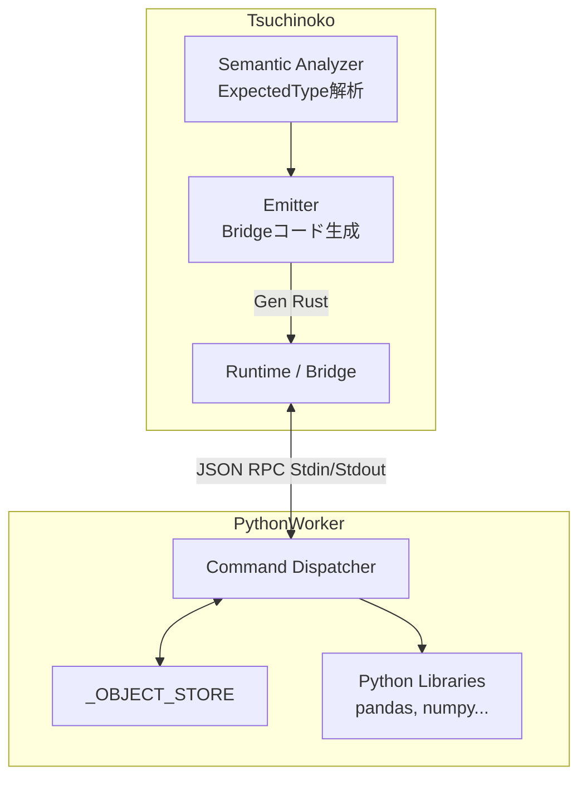
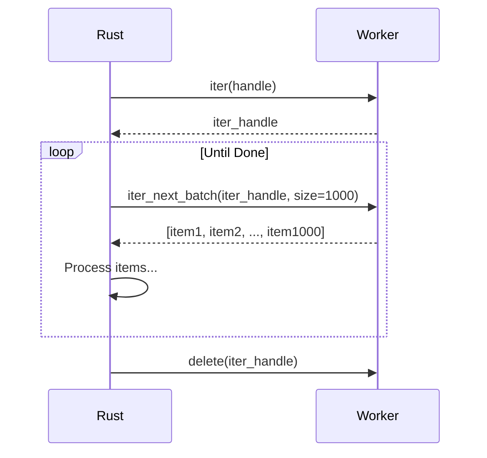

# Tsuchinoko V1.7.0 システム設計書

> **著者**: Tane Channel Technology  
> **バージョン**: 1.7.0 (Maximum A)  
> **最終更新**: 2026-01-10

---

## 1. システム概要

Tsuchinoko V1.7.0 "**Bridge Revolution**" は、従来の「値渡し」による連携に加え、**Remote Object Handle** を用いた「参照渡し」による高度な相互運用性を実現する。
これにより、Rust 側のコンパイラ構造を維持したまま、Python の強力なエコシステム（Pandas, NumPy, OpenCV等）を双方向かつステートフルに利用可能になる。

### 1.1 V1.7.0 の設計思想

1.  **Late Binding (遅延バインディング)**: `Any` 型を用い、実行時まで型決定を遅らせることで、Python の動的な挙動を Rust 上で安全に扱う。
2.  **Opaque Handle (不透明なハンドル)**: Rust 側はハンドルの内容に関知せず、ID のみを管理する。
3.  **Maximum A (現実的拡張)**: 属性アクセス、インデクサ、バッチイテレータのみをサポートし、複雑な動的機能（メタクラス操作等）はスコープ外とする。

---

## 2. アーキテクチャ (V1.7.0 Design)

### 2.1 全体構成 (Updated)

Bridge 部分が強化され、Python Worker との通信が「RPC (Remote Procedure Call)」ベースとなる。



### 2.2 コンポーネント責務

| コンポーネント | 責務 (V1.7.0) |
|---|---|
| **Semantic** | 文脈から `ExpectedType` (Any, Handle, Bool... ) を決定する。 |
| **Emitter** | `Any` 型変数に対する操作を `bridge.call_method` 等の RPC 呼び出しコードに変換する。 |
| **Bridge (Rust)** | `PyObjectHandle` の寿命管理 (`Drop` で `delete` 送信)、RPC メッセージの構築、エラーハンドリング。 |
| **Worker (Python)** | 受信したコマンドの実行、例外の捕捉、戻り値の TaggedUnion 化、オブジェクトの管理。 |

---

## 3. Remote Object Handle アーキテクチャ

### 3.1 オブジェクト管理

*   **Rust表現**: `struct PyObjectHandle { id: String, session_id: String }`
*   **Python表現**: `_OBJECT_STORE: Dict[str, Any]` (ID -> 実体 のマッピング)
*   **ライフサイクル**:
    1.  生成: Rust からの `import` やメソッド戻り値として生成され、Store に登録 + ID返却。
    2.  利用: ID を指定してメソッド呼び出しや属性アクセスを行う。
    3.  破棄: Rust 側の `Drop` トレイトにより `delete` コマンドが送信され、Store から削除される。

### 3.2 遅延バインディング (Late Binding)

`ExpectedType: Any` は「型が決まっていない」状態を表す。

```rust
// IR: var a: Any = numpy.array([1, 2])
let a = bridge.call_function("numpy.array", args)?; // Returns Handle

// IR: var b: i64 = a.sum()
let b_val = a.call_method("sum", args)?; // Returns Value(i64)
let b: i64 = b_val.try_into()?; // ここで初めて型が確定
```

### 3.3 イテレータ高速化 (Batched Iterator)

`for x in handle:` のループにおいて、毎回 `next` コマンドを投げると IPC オーバーヘッドで低速になる。
V1.7.0 では `iter_next_batch` を導入し、配列単位で転送する。



---

## 4. データ構造・プロトコル

詳細な JSON プロトコル定義は `api-spec.md` を参照。
ここでは Rust 側の内部表現を示す。

### 4.1 Tagged Union (Rust Enum)

```rust
pub enum TnkValue {
    // 基本型
    Int(i64),
    Float(f64),
    String(String),
    Bool(bool),
    None,
    
    // Remote Handle (V1.7.0)
    Handle(PyObjectHandle),
    
    // コンテナ (再帰的)
    List(Vec<TnkValue>),
    Tuple(Vec<TnkValue>),
    Dict(HashMap<String, TnkValue>),
}
```

### 4.2 Error Handling

`python_bridge::error::BridgeError` を定義し、Python 側の例外情報を保持する。

```rust
pub enum BridgeError {
    PythonException {
        py_type: String, // "IndexError"
        message: String, // "list index out of range"
        traceback: String,
        op: String,      // Debug info
    },
    Protocol(String),
    Network(std::io::Error),
    // ...
}
```

---

## 5. ユースケース検証 (Validation Scenarios)

### 5.1 Pandas DataFrame 操作

```python
import pandas as pd
df = pd.read_csv("data.csv")  # Handle生成
print(df.shape)               # get_attribute
head = df.head(5)             # call_method -> Handle
for row in head.values:       # get_attribute -> iter (batched)
    print(row)
```

### 5.2 エラー伝播

```python
l = [1, 2, 3] # Handle
try:
    print(l[10]) # get_item -> IndexError
except IndexError as e:
    print("Caught:", e)
```

Rust 側では `get_item` が `Err(BridgeError::PythonException)` を返し、それが `Result` 型で伝播され、`try/except` 構文で catch される。

---

## 6. セキュリティ設計

| 項目 | 対策 |
|---|---|
| **危険な関数** | `eval`, `exec`, `globals`, `locals` の呼び出し禁止 |
| **内部属性** | `__dict__`, `__class__` など `_` で始まる属性の取得禁止 |
| **リソース制限** | `.to_value()` の最大サイズ制限 (デフォルト 1MB) |

---

## 7. 実装計画へのリンク

詳細は `v1.7.0_execution_plan.md` および `task.md` を参照。
